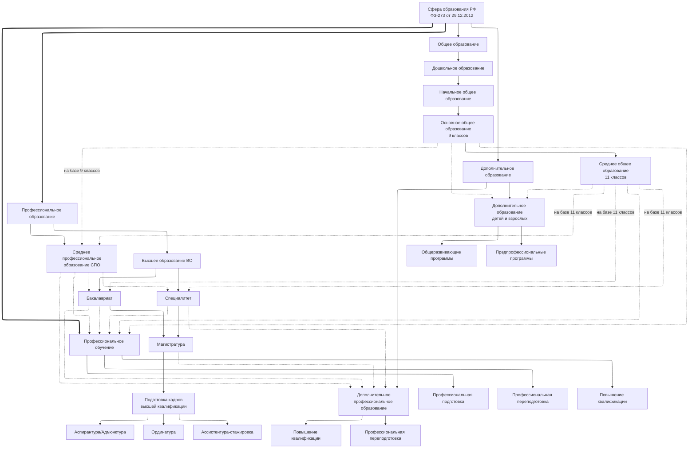

# Виды образования в Российской Федерации

**Домен:** D01 · **Тип:** справочный обзор
**Источник:** перенесено из `framework.univercon.aplicon.ru/docs/management/TypesOfEducation.md`.

---

Опорный документ по устройству российской системы образования: 4 вида, уровни и правила
переходов между ними. Используется как основа для терминологии в остальных доменах
фреймворка (в первую очередь D04, D06) и как справочник при проектировании ИС.

## Нормативная основа

Общественные отношения, возникающие в связи с реализацией права на образование,
регламентируются **ФЗ-273 от 29.12.2012 «Об образовании в Российской Федерации»**.

## Четыре вида образования

ФЗ-273 устанавливает **4 вида образования**:

- Общее образование
- Профессиональное образование
- Дополнительное образование
- Профессиональное обучение

Основными являются **общее** и **профессиональное образование**, каждое из которых
реализуется по нескольким уровням; **профессиональное обучение** стоит отдельно.

В РФ гарантируются **общедоступность и бесплатность** в соответствии с ФГОС общего и
среднего профессионального образования, а также на конкурсной основе бесплатность высшего
образования — если образование данного уровня гражданин получает **впервые**.

## Общее образование

Устанавливаются следующие уровни:

1. **Дошкольное образование**
2. **Начальное общее образование** (1–4 классы)
3. **Основное общее образование** (5–9 классы)
4. **Среднее общее образование** (10–11 классы)

**Особенности:**

- Программы общего образования преемственны — переход между уровнями последовательный
- Освоение программ **дошкольного** образования не сопровождается ни промежуточной, ни
  итоговой аттестацией
- Для зачисления в **начальное общее образование** документ об образовании предыдущего
  уровня не требуется
- Для всех последующих уровней общего и профессионального образования такой документ
  является обязательным

## Профессиональное образование

### Среднее профессиональное образование (СПО)

**Принимаются лица**, имеющие:

- Среднее общее образование
- Основное общее образование (с одновременным получением среднего общего образования в
  рамках программы СПО)

### Высшее образование (ВО)

**Структура:**

| Уровень | Описание |
|---|---|
| **Бакалавриат** | Первый уровень высшего образования |
| **Специалитет, магистратура** | Второй уровень высшего образования |
| **Подготовка кадров высшей квалификации** | Третий уровень высшего образования |

**Особенности:**

- Зачисление на программы ВО — **конкурсное** (по результатам ЕГЭ или внутренних
  испытаний, см. D05-P01, D05-P03)
- Для бакалавриата и специалитета требуется среднее (общее или профессиональное) образование
- Для магистратуры требуется высшее образование **любого** уровня

### Подготовка кадров высшей квалификации

**Виды программ:**

- **Аспирантура / Адъюнктура** — для научно-педагогических кадров
- **Ординатура** — для медицинских работников
- **Ассистентура-стажировка** — для специалистов в области искусств

**Требования к поступлению:**

- Диплом специалиста или магистра — для аспирантуры
- Высшее медицинское / фармацевтическое образование — для ординатуры
- Высшее образование в области искусств — для ассистентуры-стажировки

## Профессиональное обучение

**Направлено на:** приобретение профессиональной компетенции **без изменения уровня**
образования.

**Подвиды:**

- **Профессиональная подготовка** — для лиц, ранее не имевших профессии
- **Профессиональная переподготовка** — для получения новой профессии
- **Повышение квалификации** — для совершенствования существующих навыков

Завершается **итоговой аттестацией** в форме квалификационного экзамена.

## Дополнительное образование

### Дополнительное образование детей и взрослых

**Виды программ:**

- **Общеразвивающие** — для детей и взрослых
- **Предпрофессиональные** — в сфере искусств, физической культуры и спорта (для детей)

Допускаются любые лица без предъявления требований к уровню образования.

### Дополнительное профессиональное образование (ДПО)

**Виды программ:**

- **Повышение квалификации**
- **Профессиональная переподготовка**

**Требование:** наличие или получение среднего профессионального и/или высшего образования.

## Схема образовательных траекторий

Диаграмма показывает возможные переходы между видами и уровнями. Условные обозначения:

- **Синие сплошные** — обязательные образовательные траектории
- **Синие пунктирные** — основные профессиональные траектории (в том числе на базе СПО в ВО)
- **Красные пунктирные** — дополнительное образование и профессиональное обучение

## Как это ложится на домены фреймворка

| Уровень / вид | Применимость (доменов) |
|---|---|
| Дошкольное, НОО, ООО, СОО | Полный контур — применим ко всем ОО общего образования |
| СПО | Полный контур, но с оговорками (профмодули, промежуточная аттестация — D04) |
| ВО (бакалавриат, специалитет, магистратура) | Основной кейс большинства доменов |
| Аспирантура / ординатура / ассистентура | Отдельные особенности (научная деятельность D08) |
| ДПО | Частичная применимость: короткие программы, часто без сессии |
| ДО (детей и взрослых) | Частичная применимость: своя логика приёма и оценивания |
| Профессиональное обучение | Отдельно от образовательной деятельности, но с общим ядром событий D04 |

## Связанные документы

- **Регуляторный реестр:** [`regulatory-registry.md`](regulatory-registry.md) — полный
  список НПА по каждому уровню
- **D02:** [`opf-education-levels`](../D02-licensing/best-practices/opf-education-levels.md) —
  какие ОПФ могут лицензировать какие уровни
- **D06:** норма-ось — как ОПОП и учебный план ложатся на разные уровни
- **D04:** учебный процесс — как отличаются механики оценивания на разных уровнях
