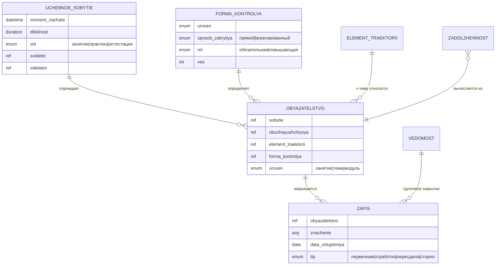

# D04 — Модель данных (платформонезависимая)

Полный первоисточник с обоснованиями — концепция академического контура v1.4 (рабочий
документ, не коммитится). Здесь — нормативная выжимка: сущности, жизненные циклы, инварианты.

---

## 1. Сущности

### 1.1 Учебное событие (родовое)

Датированный факт учебного процесса. Генератор обязательств.

| Атрибут | Описание |
|---|---|
| момент начала | дата + время |
| длительность | величина (пара / рабочий день / …) — задаётся частным случаем |
| состав | список обучающихся (черновой → факт через буфер) |
| свидетель | источник фиксации: человек / комиссия / система (СКУД, LMS, прокторинг) |
| валидатор | удостоверяющий факт — всегда человек внутри контура |
| вид | занятие / день практики / аттестационное событие |

**Частные случаи:**

- **Занятие** — длительность = пара (2 ак. часа, ≤ 90 мин без перерыва); в сетке расписания;
  способ проведения = очно/онлайн/гибрид (атрибут, не отдельный класс).
- **День (этап) практики** — длительность = рабочий день; вне сетки расписания; свидетель
  от базы/СКУД, **валидатор — кафедра** (разделение свидетель/валидатор обязательно).
- **Аттестационное событие** — порождает обязательства по 1..N элементам траектории
  (профмодуль СПО — несколько МДК одним событием).

### 1.2 Обязательство

Порождается событием для каждого участника. Независимо от других обязательств того же
события.

| Атрибут | Описание |
|---|---|
| событие-источник | ссылка |
| обучающийся | ссылка |
| элемент траектории | к чему относится (дисциплина / МДК / практика) |
| форма контроля | какая форма закрывается |
| уровень | занятие / тема / модуль |

### 1.3 Запись (закрытие обязательства)

Неизменяемый факт. Закрытость обязательства — **вычисляемое состояние** (есть ли
положительная запись), не хранимый флаг.

| Атрибут | Описание |
|---|---|
| обязательство | ссылка |
| значение | присутствие / оценка / зачёт / отсутствие (уважит./неуважит.) |
| дата | дата вступления в силу |
| свидетель, валидатор | кто зафиксировал / кто удостоверил |
| тип | первичная / отработка / пересдача / сторно |

### 1.4 Форма контроля

| Атрибут | Значения |
|---|---|
| уровень | занятие / тема / модуль |
| способ закрытия | прямой (на событии) / агрегированный (из нижележащих) |
| роль в рейтинге | обязательная (порог) / повышающая (сверх) |
| вес | условные баллы |

### 1.5 Ведомость

Групповой документ; через строки закрывает элементы индивидуальных траекторий.

Типы:
- **Обычная** — стандартная сессионная ведомость.
- **Комиссионная** — 2-я попытка ликвидации задолженности.
- **Перезачёт** — засчёт результатов, полученных в другой ОО.
- **Корректирующая** — массовое сторно строк одним документом (требует отдельного основания).

### 1.6 Академическая задолженность

**Вычисляемое состояние**, не отдельная таблица: есть обязательство уровня дисциплины без
положительной записи, дата сессии прошла. Жизненный цикл — см. §2.2.

### 1.7 Учётная политика

Версионируемая сущность с периодом действия, привязана к подразделению; на свой период
неизменна. Настраивает: размер буфера затвердевания, момент закрытия модуля,
веса/тип формулы оценивания, пороги, сроки, лимиты попыток.

**Не настраивает** природу факта и механику обязательств.

---

## 2. Жизненные циклы

### 2.1 Учебное событие

```
[Запланировано] → [Началось] → состав черновой
  ├─ отмена внутри буфера → [Не состоялось]
  │   (черновые обязательства аннулированы бесследно)
  ├─ буфер истёк → состав затвердел в факт
  │   └─ рубеж: закрытие модуля → снимок рейтинга текущего контроля
  └─ отмена после буфера → сторно документом-основанием
```

### 2.2 Академическая задолженность

```
[Возникла]
  (отрицательная запись ведомости + дата сессии прошла)
  │
  ├─ таймер: дата возникновения + периоды-исключения (снимок из D05) ≤ 1 года
  │
  ├─ кафедра предложила слот → доказательство исполнения обязанности ОО
  │
  ├─ Попытка 1 (обычная ведомость):
  │   ├─ положит. → [Ликвидирована]
  │   └─ отриц. / неявка → засчитана как использованная
  │
  ├─ Попытка 2 (комиссионная ведомость):
  │   ├─ положит. → [Ликвидирована]
  │   └─ отриц. / неявка → [Исчерпана]
  │
  ├─ срок истёк + есть факт неявки / отказа на предложенный слот → [Просрочена]
  └─ срок истёк, но слот НЕ предлагался → НЕ [Просрочена]
      (организационный долг вуза; автоматическое отчисление незаконно)

[Исчерпана] / [Просрочена] → основание для отчисления документом (система сигнализирует,
                               не отчисляет автоматически)
```

---

## 3. Инварианты

1. **Закрытость вычисляется**, не хранится: обязательство закрыто ⇔ существует положительная
   запись.
2. **Каждое обязательство закрывается своей записью**; одно обязательство не блокирует другое.
3. **Состав события — факт присутствия**, не проекция группы; перевод студента не меняет
   прошлое присутствие.
4. **До закрытия модуля — живой агрегат, после — снимок.** Рейтинг текущего контроля
   фиксируется снимком при закрытии модуля (владелец — кафедра); далее меняется только
   корректирующим документом.
5. **Итоговая оценка** = текущий контроль (до 70) + аттестация (до 30) → 100-балльная →
   5-балльная. Это дефолтная формула; тип формулы — **политика**. Минимум рейтинговой
   части — условие положительной оценки.
6. **Переход задолженности в [Просрочена]** требует доказанной вины студента (неявка/отказ
   на реально предложенный слот), не просто истечения календарного срока.
7. **Срок задолженности — зачётное время**: дата возникновения + исключения; ≤ 1 года
   (потолок задан ФЗ-273 ч. 5 ст. 58 ⚠ сверить, организация может короче).
8. **Зачётка — представление**, не источник: витрина положительных исходов ведомостей.
   Обложка зачётки принадлежит D05.
9. **Отработка пропуска** снимает дисциплинарное обязательство (допуск), но **не возвращает**
   баллы БРС за присутствие.
10. **Рейтинг — условие допуска к аттестации, но не блок.** Недостаточный рейтинг не
    является основанием для юридического отказа в допуске к промежуточной аттестации:
    ФЗ-273 такого права ОО не предоставляет. Система фиксирует нарушение условий и
    **сигнализирует** ответственному — запрещающего действия не производит. Решение
    оформляется документом человеком. ⚠ Требует юридической проверки перед переводом в review.

---

## 4. Контракты с другими доменами

### D04 ↔ D05: таймер задолженности

D04 запрашивает у D05 **снимок периодов-исключений** (академотпуск, болезнь, БиР) для
конкретного обучающегося на дату возникновения задолженности. Снимок пересчитывается только
при поступлении нового события-исключения из D05 (не при каждом вычислении).

D04 поставляет D05 **триггер выговора** (факт превышения порога неуважительных пропусков).
Сам выговор оформляется и хранится в D05 (D05 — владелец).

### D04 → D09: оказанный объём

Журнал D04 даёт «оказанный объём» для расчёта возврата **платным** обучающимся при
расторжении договора (D09-P05).

Для бюджетников (КЦП) источник оказанного объёма — **контингент D05 + ведомости D04**, не
журнал. Это разные контракты; не подменять.

---

## 5. ERD (mermaid)



> Задолженность показана пунктирно: это вычисляемое состояние обязательства, не отдельная
> таблица.
