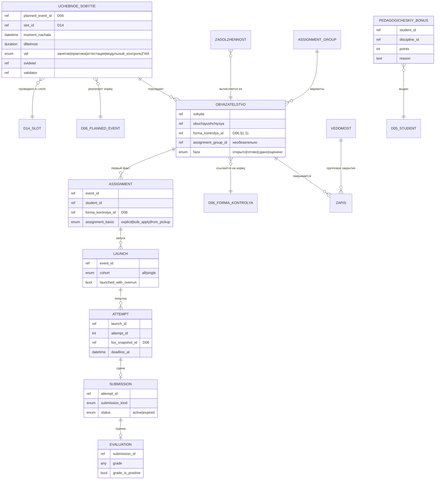

# D04 — Модель данных (платформонезависимая)

Первоисточник — концепция академического контура v1.4 (`inbox/2026-07-06-academic-concept-v1.4.pdf`) + обогащение из Дидактикон Блок III и доклада «Цифровая инфраструктура вуза» (2026-07-06).

D04 — **факт реализации**. **План** — в D06 (запланированные учебные события, формы контроля как норма, пакет занятия). **Развёртка** — в D14 (слот расписания).

---

## 1. Сущности

### 1.1 Учебное событие (родовое, факт реализации)

Датированный факт учебного процесса. Генератор обязательств. Термин совпадает с academic-concept v1.4 §4 — «несущая стена» модели (доклад §4).

| Атрибут | Описание |
|---|---|
| id | Идентификатор |
| planned_event_id | Ссылка на запланированное событие D06 §1.12 (реализует эту норму) |
| slot_id | Ссылка на слот расписания D14 §1.3 (в контексте которого проведено) |
| момент начала | дата + время |
| длительность | пара / рабочий день / N часов — из слота D14 |
| вид | наследуется из D06.PlannedEvent.вид: занятие / модульный_контроль / экзамен / зачёт / курсовая / день_практики / ГИА |
| состав | список обучающихся (черновой → факт через буфер) |
| свидетель | источник фиксации: человек / комиссия / система (СКУД, LMS, прокторинг) |
| валидатор | удостоверяющий факт — всегда человек внутри контура |

**Состав события — пересечение × снимок.** Из §4 доклада:

> «Состав каждого учебного события формируется в момент его наступления, из тех, у кого это событие стоит в траектории, и чей статус позволяет на нём быть.»

Технически: снимок берётся из состава слота D14 (уже вычисленный именованный отбор) × применяется `assignment_mode` формы контроля события (`all` / `per_student`).

**Один главный педагог на событии** (Дидактикон §2.12). Никакого разделения runtime-ответственности. Многопедагогические сценарии — вне MVP.

**Частные случаи** (из academic-concept v1.4 §4.3):

- **Занятие** — вид пакета в РПД; способ проведения = очно/онлайн/гибрид (атрибут, не отдельный класс)
- **День практики** — длительность = рабочий день; свидетель — база / СКУД / скан, валидатор — кафедра
- **Аттестационное событие** — 1..N обязательств одновременно; свидетель — комиссия, валидатор — председатель

### 1.2 Обязательство

Порождается событием для каждого участника состава. Независимо от других обязательств того же события.

| Атрибут | Описание |
|---|---|
| id | Идентификатор |
| событие-источник | ссылка на §1.1 |
| обучающийся | ссылка на D05 |
| элемент траектории | к чему относится (дисциплина / МДК / практика) |
| forma_kontrolya_id | Ссылка на форму контроля как норму (D06 §1.11) |
| фаза | открыто / готово / сдано / оценено (см. §2.3) |

**Двухфазность форм контроля** (Дидактикон Блок III §8) с бинарным принятием:

```
открыто → готово → сдано → оценено
                          ├─ положительно → закрыто
                          └─ отрицательно → рождает обязательство «пересдача формы»
```

Каждая попытка — отдельная запись. Никакого цикла «доработай ту же попытку».

**Разведение** (Дидактикон Блок III §8):

| Механизм | Природа | Approval | Что порождает |
|---|---|---|---|
| **Пересдача формы** | Отрицательная оценка ⇒ новое обязательство | Нет (автоматически) | Новые 5 фактов (§1.3) на новой попытке |
| **Отработка пропуска** | Студент пропустил само событие | Да (педагог / куратор подтверждает слот) | Отдельный approval-based флоу (не 5 фактов) |

Первое живёт целиком в D04; второе — отдельный процесс с участием куратора и приказом.

### 1.3 Пять фактов формы контроля

Дидактикон Блок III §13 — жизненный цикл одной попытки закрытия формы контроля. Пять независимых фактов; каждый — отдельная запись, неизменяемая.

Для обычных форм:
```
assignment → launch → attempt → submission → evaluation
```

Для pre_event-бонусов добавляется первый факт `pickup` (студент «взял бонус» для подготовки).

**assignment** — назначение формы конкретному студенту

| Атрибут | Описание |
|---|---|
| event_id | Ссылка на учебное событие §1.1 |
| student_id | Обучающийся |
| forma_kontrolya_id | Форма контроля из D06 |
| assignment_group_id? | Ссылка на группу вариантов (§1.4) |
| assigned_by | Кто назначил |
| assigned_at | Когда |
| assignment_basis | explicit / bulk_apply / from_pickup |

**launch** — запуск формы (педагогом или студентом)

| Атрибут | Описание |
|---|---|
| event_id | Ссылка на событие |
| forma_kontrolya_id | Форма |
| cohort | all (запуск на весь состав) / single (индивидуальный вызов) |
| launched_by | Кто запустил |
| launched_at | Когда |
| launched_with_overrun | bool — для inline: запущено ли за пределы длительности события |
| expected_overrun_minutes | int? — оценка переработки |

**attempt** — попытка студента (заступление в форму)

| Атрибут | Описание |
|---|---|
| launch_id | Ссылка на запуск |
| student_id | Кто попытался |
| attempt_id | Идентификатор попытки (счётчик по обязательству) |
| started_at | Момент начала |
| fos_snapshot_id | Снимок ФОС на момент попытки (из D06) |
| deadline_at | Дедлайн: для inline = launched_at + duration; для extended = launched_at + extended_срок |

**submission** — сдача (что именно сдал)

| Атрибут | Описание |
|---|---|
| attempt_id | Ссылка на попытку |
| submitted_at | Момент сдачи |
| submission_kind | текст / файл / устно / комплексно |
| content_ref | Ссылка на содержимое сдачи |
| status | active / expired (для принудительно завершённых inline-форм) |

**evaluation** — оценка сдачи

| Атрибут | Описание |
|---|---|
| submission_id | Ссылка на сдачу |
| evaluated_by | Кто оценил |
| evaluated_at | Когда |
| grade | Значение оценки (по шкале формы контроля D06) |
| grade_is_positive | bool — двухфазное бинарное принятие |
| comment | ? |

**Инварианты цепочки:**
1. Каждая запись цепочки — неизменяема; исправление — только сторно + новая запись.
2. Отрицательная evaluation → новое обязательство «пересдача формы» → новые 5 фактов.
3. Принудительное завершение inline-формы при переходе слота D14 в «завершено»: для не завершивших студентов автоматически создаются `submission` со статусом `expired` и `evaluation` со статусом `expired_no_attempt` / `expired_during_attempt`.

### 1.4 Assignment group — вариативные формы

Дидактикон Блок III §11.5. Группа взаимозаменяемых вариантов одной формы контроля. Назначение одного варианта студенту **автоматически снимает** остальные для него.

| Атрибут | Описание |
|---|---|
| id | Идентификатор группы |
| naimenovanie | «Варианты контрольной работы №3» |
| forma_kontrolya_id | Ссылка на форму контроля в D06 (одна норма — много вариантов) |
| varianty | список ссылок на конкретные варианты формы |

**Инвариант:** у одного студента в рамках одной группы вариантов может быть **ровно одно** активное обязательство. Назначение второго варианта — стирает первое.

### 1.5 Запись (закрытие обязательства)

Неизменяемый факт. Закрытость обязательства — **вычисляемое состояние** (есть ли положительная evaluation), не хранимый флаг.

| Атрибут | Описание |
|---|---|
| id | Идентификатор |
| обязательство | ссылка |
| значение | присутствие / оценка / зачёт / отсутствие (уважит./неуважит.) |
| дата | дата вступления в силу |
| свидетель, валидатор | кто зафиксировал / кто удостоверил |
| тип | первичная / отработка / пересдача / сторно |

**Запись** для форм с 5 фактами — это, по сути, `evaluation` §1.3, спроецированная в единую сущность на уровне обязательства для целей БРС и агрегации. Для дисциплинарного контроля запись — прямое отражение факта присутствия/отсутствия.

### 1.6 Ведомость

Групповой документ; через строки закрывает элементы индивидуальных траекторий.

Типы:
- **Обычная** — стандартная сессионная ведомость
- **Комиссионная** — 2-я попытка ликвидации задолженности
- **Перезачёт** — засчёт результатов, полученных в другой ОО
- **Корректирующая** — массовое сторно строк одним документом (требует отдельного основания)

### 1.7 Педагогический бонус

Дидактикон Блок III §14. **Отдельный механизм, вне пакета и вне ФОС.** Педагог в любой момент даёт студенту баллы с указанием причины. Лимит — политика подразделения.

Не относится к жизненному циклу формы контроля. Самостоятельный факт:

| Атрибут | Описание |
|---|---|
| id | Идентификатор |
| student_id | Обучающийся |
| discipline_id | Дисциплина, к БРС которой относится |
| module_id? | Модуль |
| points | Количество баллов |
| reason | Обоснование педагога |
| awarded_by | Кто присудил |
| awarded_at | Когда |

**Инварианты:**
1. Прозрачен студенту — он видит бонус и причину.
2. Учитывается в БРС наравне с пакетными формами.
3. Лимит на сумму бонусов в семестр — параметр учётной политики.
4. Не порождает обязательств у студента — просто добавляет баллы.

### 1.8 Академическая задолженность

**Вычисляемое состояние**, не отдельная таблица: есть обязательство уровня дисциплины без положительной записи, дата сессии прошла. Жизненный цикл — см. §2.2.

Расширяется до трёх видов (доклад §5):

- **Дисциплинарная** — из событий внутри дисциплины (пропуск занятия, несданный модульный контроль, незащищённая лабораторная)
- **Академическая** — из аттестационных событий уровня программы (экзамен, курсовая, ГИА); работает ФЗ-273 ч. 5 ст. 58
- **Финансовая** — из административных событий (D09; наступил семестр по приказу → обязательство по договору)

Все три — **одна мета-механика** (событие → обязательство → запись), но события у каждой свои.

### 1.9 Учётная политика

Версионируемая сущность с периодом действия, привязана к подразделению; на свой период неизменна. Настраивает: размер буфера затвердевания, момент закрытия модуля, веса/тип формулы оценивания, пороги, сроки, лимиты попыток, лимит педагогических бонусов.

**Не настраивает** природу факта и механику обязательств.

---

## 2. Жизненные циклы

### 2.1 Учебное событие

> **План** учебного события живёт в D06 (§1.12 D06/entities.md — запланированное учебное событие в РПД или УП). **Развёртка на календарь** — в D14 (слот расписания, §1.3 D14/entities.md; один слот может покрывать 1..N событий D06). **Факт реализации** — в D04. D04 получает событие уже в [Началось] — инициировано при переходе слота D14 в «идёт». Состав передаётся снимком именованного отбора слота, вычисленного против D05.

```
(D06 план + D14 разворачивание) → [Началось] → состав черновой
  ├─ отмена внутри буфера → [Не состоялось]
  │   (черновые обязательства аннулированы бесследно)
  ├─ буфер истёк → состав затвердел в факт
  │   └─ рубеж: закрытие модуля → снимок рейтинга текущего контроля
  └─ отмена после буфера → сторно документом-основанием
```

### 2.2 Академическая задолженность

```
[Возникла]
  (отрицательная запись ведомости + дата сессии прошла)
  │
  ├─ таймер: дата возникновения + периоды-исключения (снимок из D05) ≤ 1 года
  │
  ├─ кафедра предложила слот → доказательство исполнения обязанности ОО
  │
  ├─ Попытка 1 (обычная ведомость):
  │   ├─ положит. → [Ликвидирована]
  │   └─ отриц. / неявка → засчитана как использованная
  │
  ├─ Попытка 2 (комиссионная ведомость):
  │   ├─ положит. → [Ликвидирована]
  │   └─ отриц. / неявка → [Исчерпана]
  │
  ├─ срок истёк + есть факт неявки / отказа на предложенный слот → [Просрочена]
  └─ срок истёк, но слот НЕ предлагался → НЕ [Просрочена]
      (организационный долг вуза; автоматическое отчисление незаконно)

[Исчерпана] / [Просрочена] → основание для отчисления документом (система сигнализирует,
                               не отчисляет автоматически)
```

### 2.3 Двухфазность формы контроля

```
открыто → готово → сдано → оценено
                          ├─ положительно → закрыто
                          └─ отрицательно → новое обязательство «пересдача формы»
                                            (новые 5 фактов на новой попытке)
```

**Отработка пропуска — отдельный флоу** (approval-based):

```
студент пропустил слот → студент запросил слот отработки → куратор/педагог подтвердил
                                                        → назначен новый слот
                                                        → закрытие обязательства присутствия
```

Не порождает 5 фактов формы контроля; работает через **приказ / согласие** ответственного.

---

## 3. Инварианты

1. **Закрытость вычисляется**, не хранится: обязательство закрыто ⇔ существует положительная запись (или положительная evaluation).
2. **Каждое обязательство закрывается своей записью**; одно обязательство не блокирует другое.
3. **Состав события — пересечение × снимок.** Формулировка §4 доклада: «состав каждого учебного события формируется в момент его наступления, из тех, у кого это событие стоит в траектории, и чей статус позволяет на нём быть». Состав слота D14 × `assignment_mode` формы контроля.
4. **Состав события — факт присутствия**, не проекция группы; перевод студента не меняет прошлое присутствие.
5. **До закрытия модуля — живой агрегат, после — снимок.** Рейтинг текущего контроля фиксируется снимком при закрытии модуля (владелец — кафедра); далее меняется только корректирующим документом.
6. **Итоговая оценка** = текущий контроль (до 70) + аттестация (до 30) → 100-балльная → 5-балльная. Это дефолтная формула; тип формулы — **политика**. Минимум рейтинговой части — условие положительной оценки.
7. **Переход задолженности в [Просрочена]** требует доказанной вины студента (неявка/отказ на реально предложенный слот), не просто истечения календарного срока.
8. **Срок задолженности — зачётное время**: дата возникновения + исключения; ≤ 1 года (потолок задан ФЗ-273 ч. 5 ст. 58 ⚠ сверить, организация может короче).
9. **Зачётка — представление**, не источник: витрина положительных исходов ведомостей. Обложка зачётки принадлежит D05.
10. **Отработка пропуска** снимает дисциплинарное обязательство (допуск), но **не возвращает** баллы БРС за присутствие.
11. **Рейтинг — условие допуска к аттестации, но не блок.** Недостаточный рейтинг не является основанием для юридического отказа в допуске к промежуточной аттестации: ФЗ-273 такого права ОО не предоставляет. Система фиксирует нарушение условий и **сигнализирует** ответственному — запрещающего действия не производит. Решение оформляется документом человеком. ⚠ Требует юридической проверки перед переводом в review.
12. **Один главный педагог на событии** (MVP-принцип, Дидактикон §2.12). Никакого разделения runtime-ответственности. Многопедагогические сценарии — вне MVP.
13. **Пересдача формы ≠ Отработка пропуска.** Пересдача автоматическая, порождает 5 новых фактов; отработка — approval-based, отдельный процесс через куратора / приказ.
14. **Assignment group: одно активное обязательство на студента.** Назначение второго варианта в группе автоматически снимает первое.
15. **Педагогический бонус — вне цикла формы контроля.** Не порождает обязательств у студента; учитывается в БРС наравне с формами; лимит — учётная политика.
16. **Форма контроля как норма — в D06.** D04 не хранит определений форм — только ссылки на D06.§1.11 и факты их закрытия.

---

## 4. Контракты с другими доменами

### D06/D14 → D04: план + разворачивание → учебное событие

**План** запланированных учебных событий живёт в D06 (§1.12 D06/entities.md): одно событие имеет вид, источник (РПД или УП), форму контроля, пакет. **Развёртка** на календарь — в D14: слот расписания (§1.3 D14) с временем и ресурсами, покрывающий 1..N запланированных событий D06.

При переходе слота D14 в состояние «идёт» D14 инициирует создание учебных событий D04 — по одному для каждого запланированного события D06, привязанного к слоту. Передаётся:
- ссылка на запланированное событие D06 (норма: вид, форма контроля, пакет)
- ссылка на слот D14 (runtime: время, аудитория, преподаватель)
- снимок состава именованного отбора слота (вычислен против D05.Членство в группе)

D04 замораживает снимок через буфер и далее управляет обязательствами, записями, задолженностями самостоятельно. Состав каждого учебного события — пересечение снимка состава слота × правил `assignment_mode` формы контроля события.

Статус «запланировано» принадлежит D06 (план) и D14 (слот в состоянии перед стартом). D04 работает только с фактами реализации.

### D06 → D04: форма контроля как норма

D06 §1.11 владеет **нормой** формы контроля (уровень, три оси, вес, тип оценки). D04 владеет **фактами** её закрытия (5 фактов §1.3). Одна норма D06 порождает множество фактов D04.

Правка нормы задним числом запрещена — только новая версия РПД (D06 §2). Прошлые факты — только через сторно (§1.5 запись, тип «сторно»).

### D04 ↔ D05: таймер задолженности + траектория

D04 запрашивает у D05 **снимок периодов-исключений** (академотпуск, болезнь, БиР) для конкретного обучающегося на дату возникновения задолженности. Снимок пересчитывается только при поступлении нового события-исключения из D05 (не при каждом вычислении).

D04 поставляет D05 **триггер выговора** (факт превышения порога неуважительных пропусков). Сам выговор оформляется и хранится в D05 (D05 — владелец).

**Траектория обучающегося (D05)** — источник для формирования состава события: «кто имеет это событие в траектории» × «чей статус активен на дату».

### D04 → D09: оказанный объём

Журнал D04 даёт «оказанный объём» для расчёта возврата **платным** обучающимся при расторжении договора (D09-P05).

Для бюджетников (КЦП) источник оказанного объёма — **контингент D05 + ведомости D04**, не журнал. Это разные контракты; не подменять.

---

## 5. ERD (mermaid)



> Задолженность показана пунктирно: это вычисляемое состояние обязательства, не отдельная таблица. `Assignment → Launch → Attempt → Submission → Evaluation` — цепочка пяти фактов формы контроля (Дидактикон Блок III §13); каждый — неизменяемая запись.
