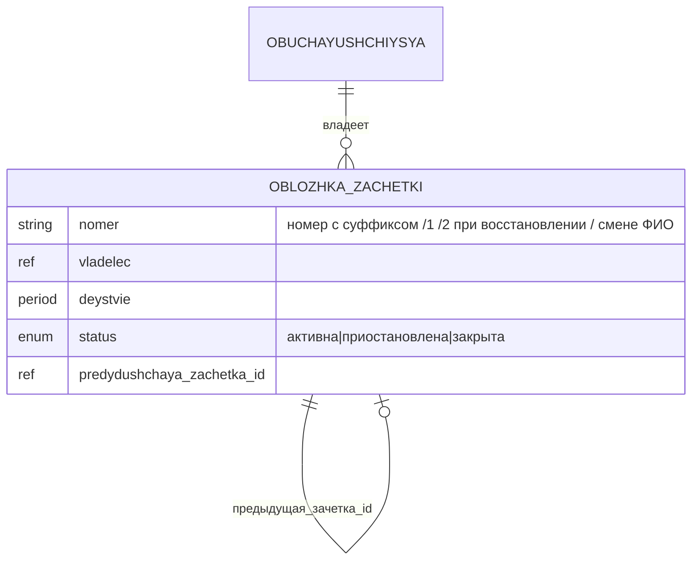
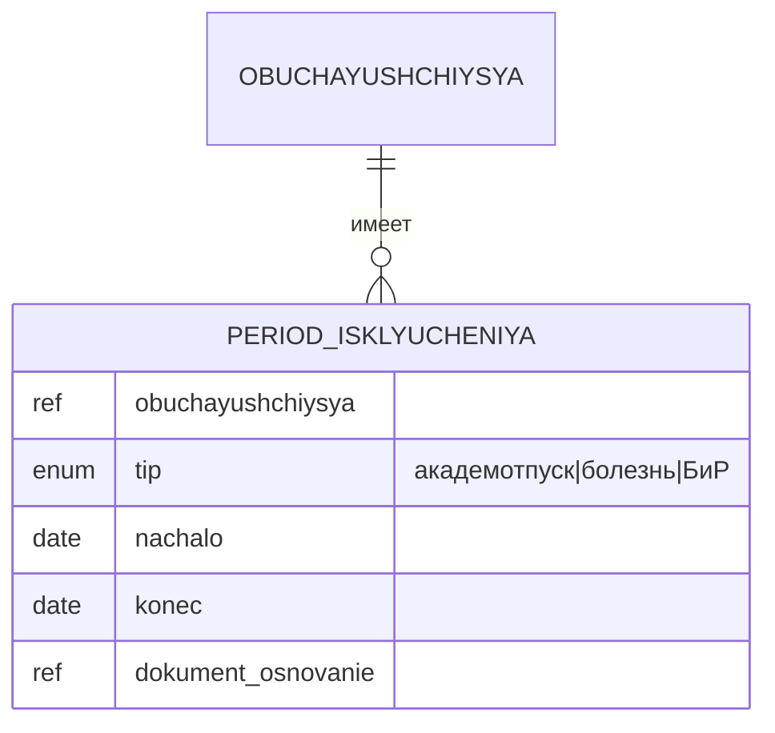
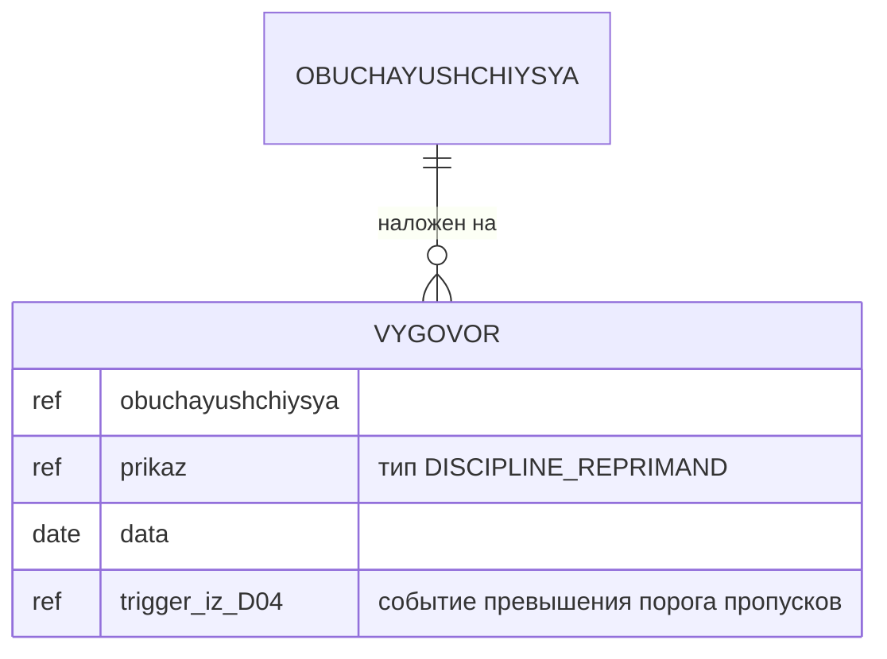
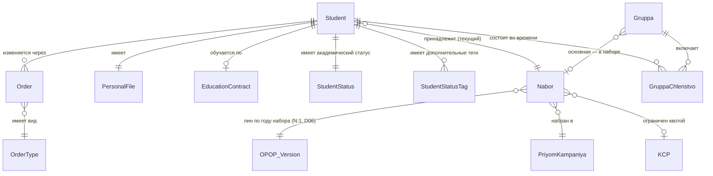

# D05: Модель данных — сущности

## Обучающийся (Student)

| Атрибут | Тип | Описание | Источник |
|---|---|---|---|
| id | UUID | Внутренний идентификатор | ИС |
| last_name | string | Фамилия | Личное дело |
| first_name | string | Имя | Личное дело |
| middle_name | string? | Отчество | Личное дело |
| snils | string | СНИЛС | Документ |
| birth_date | date | Дата рождения | Паспорт |
| citizenship | enum | РФ / ЕАЭС / иное | Документ |
| status_id | FK→StudentStatus | Текущий академический статус | Приказ |
| financing | enum | бюджет / договор / целевое | Приказ / договор |
| enrollment_date | date | Дата зачисления | Приказ о зачислении |
| nabor_id | FK→Набор | Текущий набор (когорта) обучающегося — источник истины о норме | Приказ |
| program_id | FK→Program | **Производное** от набора (Набор → версия ОПОП). Не самостоятельный источник истины | Расчётное |
| course | int | Курс/год обучения | Расчётный |
| statuses | list[StudentStatusTag] | Множественные статусы (соц., фин., воинск.) | Разные источники |

> **Изменения шага 2 (норма-ось):** `group_id` удалён — членство в группах вынесено в связь
> «многие-ко-многим во времени» (см. ниже). `nabor_id` добавлен. `program_id` стал
> производным от набора. Миграция: текущие `group_id` → членство с `s = enrollment_date`,
> `tip = основная учебная`.

## Таксономия статусов обучающегося

Статусы разделяются на **академический статус** (один, определяет факт обучения)
и **дополнительные теги** (несколько одновременно, описывают характеристики).

### Академический статус (StudentStatus)

| Код | Название | Срочность |
|---|---|---|
| APPLICANT | Абитуриент | До зачисления |
| ENROLLED | Зачислен (активный) | Бессрочный |
| INDIVIDUAL_PLAN | Обучение по ИУП | Срочный |
| TRANSFERRED_COURSE | Переведён на следующий курс/программу | Бессрочный |
| ACADEMIC_LEAVE | Академический отпуск | Срочный |
| ACADEMIC_LEAVE_CHILD | Акад. отпуск по уходу за ребёнком | Срочный |
| REINSTATED | Восстановлен | Бессрочный |
| GIA_EXTERN | Прикреплён для сдачи ГИА | Срочный |
| EXPELLED_GRADUATE | Отчислен в связи с получением образования | Бессрочный |
| EXPELLED_OWN | Отчислен по собственному желанию | Бессрочный |
| EXPELLED_ACADEMIC | Отчислен за неуспеваемость | Бессрочный |
| EXPELLED_CONTRACT | Отчислен за невыполнение условий договора | Бессрочный |
| EXPELLED_DISCIPLINE | Отчислен как мера дисциплинарного взыскания | Бессрочный |
| EXPELLED_RESTORABLE | Отчислен с правом восстановления | Срочный |
| ARCHIVED | В архиве | Бессрочный |

### Теги — финансовый статус

| Тег | Описание | Срочность |
|---|---|---|
| BUDGET | Бюджет | Бессрочный* |
| CONTRACT | Договор (платно) | Срочный |
| TARGET_CONTRACT | Целевой договор | Срочный |
| TARGET_VIOLATED | Нарушил целевой договор | Бессрочный |

### Теги — стипендиальный статус

| Тег | Описание | Срочность |
|---|---|---|
| STIPEND_ACADEMIC | Академическая стипендия | Срочный |
| STIPEND_SOCIAL | Социальная стипендия | Срочный |
| STIPEND_NAMED | Именная / повышенная стипендия | Срочный |

### Теги — социальный статус

| Тег | Описание | Объект привязки | Срочность |
|---|---|---|---|
| DISABILITY_1 / _2 / _3 | Инвалид I/II/III группы | Физлицо | Срочный |
| ORPHAN | Сирота | Физлицо | Бессрочный |
| LARGE_FAMILY | Из многодетной семьи | Физлицо | Бессрочный |
| LOW_INCOME | Малоимущий | Физлицо | Срочный |
| VETERAN | Ветеран боевых действий | Физлицо | Бессрочный |
| PREGNANT | Беременная | Физлицо | Срочный |
| PARENT | Родитель | Физлицо | Бессрочный |
| DISABILITY_HIA | Лицо с ОВЗ | Физлицо | Срочный |

### Теги — миграционный статус

| Тег | Описание | Срочность |
|---|---|---|
| FOREIGNER_VNZh | Иностранный гражданин (ВНЖ) | Срочный |
| FOREIGNER_RVP | Иностранный гражданин (РВП) | Срочный |
| FOREIGNER_VISA | Иностранный гражданин (виза) | Срочный |
| COMPATRIOT | Соотечественник | Бессрочный |

### Теги — воинский учёт

| Тег | Описание | Срочность |
|---|---|---|
| MILITARY_OBLIGATED | Военнообязанный | Бессрочный* |
| MILITARY_EXEMPT | Не военнообязанный | Бессрочный |
| MILITARY_DEFERRAL | Имеет отсрочку от призыва | Срочный |

### Теги — статус общежития

| Тег | Описание | Срочность |
|---|---|---|
| DORM_NEEDED | Нуждается в общежитии | Срочный |
| DORM_PROVIDED | Предоставлено общежитие | Срочный |
| DORM_EXPELLED | Выселен из общежития | Бессрочный |
| DORM_BANNED | Лишён права на общежитие | Срочный/Бессрочный |

### Теги — статус документов

| Тег | Описание | Срочность |
|---|---|---|
| DIPLOMA_ISSUED | Диплом выдан | Бессрочный |
| DIPLOMA_HONORS | Диплом с отличием | Бессрочный |
| DIPLOMA_DUPLICATE | Дубликат документа выдан | Бессрочный |

---

## Классификатор приказов по контингенту

> Источник: `framework.univercon.aplicon.ru/docs/students/database/list_of_orders.md`

### Блок А · Начало образовательных отношений

| Код | Вид приказа |
|---|---|
| ENROLL_MAIN | Зачисление на обучение по основным ОП |
| ENROLL_TRANSFER_IN | Зачисление в порядке перевода из другой ОО |
| ENROLL_EXTERN | Зачисление экстерна для сдачи промежуточной и ГИА |
| REINSTATE_AFTER_EXPEL | Восстановление после отчисления |
| REINSTATE_AFTER_LEAVE | Возвращение из академического отпуска |

### Блок Б · Академическая мобильность

| Код | Вид приказа |
|---|---|
| CHANGE_PROGRAM | Перевод на другую образовательную программу |
| CHANGE_FORM | Перевод на другую форму обучения |
| TRANSFER_COURSE | Перевод на следующий курс |
| CHANGE_FINANCING | Изменение способа возмещения затрат (бюджет/договор) |
| IUP_GRANT | Перевод на индивидуальный учебный план |
| IUP_CANCEL | Прекращение обучения по ИУП |
| ACCELERATED | Организация ускоренного обучения |
| EXTERN_CREDITS | Зачёт результатов обучения экстернов |
| PRACTICE_STUDY | Направление на учебную практику |
| PRACTICE_PRODUCTION | Направление на производственную практику |
| PRACTICE_PREDIPLOM | Направление на преддипломную практику |

### Блок В · Академические и социальные отпуска

| Код | Вид приказа |
|---|---|
| ACADEMIC_LEAVE_GRANT | Предоставление академического отпуска |
| ACADEMIC_LEAVE_EXTEND | Продление академического отпуска |
| ACADEMIC_LEAVE_EARLY | Досрочный выход из академического отпуска |
| MATERNITY_LEAVE | Отпуск по беременности и родам |
| CHILD_CARE_LEAVE | Отпуск по уходу за ребёнком |
| CHILD_CARE_RETURN | Выход из отпуска по уходу за ребёнком |

### Блок Г · Завершение образовательных отношений

| Код | Вид приказа |
|---|---|
| GIA_ADMIT | Допуск к государственной итоговой аттестации |
| VKR_TOPICS | Утверждение тем выпускных квалификационных работ |
| VKR_SUPERVISORS | Утверждение руководителей ВКР |
| EXPEL_GRADUATE | Отчисление в связи с получением образования |
| EXPEL_OWN | Отчисление по собственному желанию |
| EXPEL_ACADEMIC | Отчисление за неуспеваемость |
| EXPEL_CONTRACT | Отчисление за невыполнение условий договора |
| EXPEL_DISCIPLINE | Отчисление как мера дисциплинарного взыскания |

### Блок Д · Административно-организационные процедуры

| Код | Вид приказа |
|---|---|
| CHANGE_NAME | Изменение ФИО |
| CHANGE_CITIZENSHIP | Изменение гражданства |
| CHANGE_PASSPORT | Изменение паспортных данных |
| DOC_DIPLOMA | Выдача диплома и приложения |
| DOC_DIPLOMA_DUPLICATE | Выдача дубликата документа об образовании |
| DOC_STUDENT_CARD_DUP | Выдача дубликата студенческого билета |
| DOC_GRADEBOOK_DUP | Выдача дубликата зачётной книжки |
| DORM_CHECKIN | Заселение в общежитие |
| DORM_TRANSFER | Переселение в общежитии |
| DORM_CHECKOUT | Выселение из общежития |

### Блок Е · Стимулирование и дисциплина

| Код | Вид приказа |
|---|---|
| STIPEND_ACADEMIC | Назначение государственной академической стипендии |
| STIPEND_SOCIAL | Назначение государственной социальной стипендии |
| STIPEND_PRESIDENT | Назначение стипендии Президента / Правительства РФ |
| MATERIAL_AID | Оказание материальной помощи |
| STATE_SUPPORT_FULL | Полное государственное обеспечение |
| DISCIPLINE_REMARK | Дисциплинарное взыскание: замечание |
| DISCIPLINE_REPRIMAND | Дисциплинарное взыскание: выговор |
| DISCIPLINE_LIFT | Снятие дисциплинарного взыскания |

### Блок Ж · Организационное обеспечение

| Код | Вид приказа |
|---|---|
| COMMISSION_GEC | Формирование государственной экзаменационной комиссии |
| COMMISSION_APPEAL | Формирование апелляционной комиссии |
| COMMISSION_TRANSFER | Формирование комиссии по переводам и восстановлениям |

### Блок З · Корректировка и отмена приказов

| Код | Вид приказа |
|---|---|
| ORDER_AMEND_TECH | Исправление технической ошибки в приказе |
| ORDER_AMEND_DETAILS | Изменение реквизитов приказа |
| ORDER_AMEND_SUPPLEMENT | Дополнение приказа |
| ORDER_CANCEL_CIRCUMSTANCES | Отмена приказа в связи с изменением обстоятельств |
| ORDER_CANCEL_VIOLATION | Отмена приказа в связи с выявлением нарушений |
| ORDER_CANCEL_COURT | Отмена приказа по решению суда или вышестоящих органов |

---

## Сцепка с нормой (D06): Набор и приёмная кампания

Точка соединения двух осей — «кого/сколько» (D05) и «чему/как» (D06) — в одной сущности:
**Набор**. До этого шага у обучающегося была плоская ссылка `program_id` без версии и
когорты; теперь источник истины о норме — набор.

### Набор (когорта)

Носитель привязки контингента к норме. Естественный ключ: специальность/направление ×
форма обучения × год набора.

| Атрибут | Тип | Описание |
|---|---|---|
| id | UUID | Идентификатор |
| napr_spec | FK | Специальность/направление |
| forma_obucheniya | enum | очная / очно-заочная / заочная |
| god_nabora | int | Год набора — ключ привязки к версии нормы |
| opop_versiya_id | FK→D06.Версия ОПОП | **Привязка к версии ОПОП.** Неизменна после создания набора |
| priyom_id | FK→Приёмная кампания | В какой кампании набран |
| naimenovanie | string | Например: «09.02.07, очная, набор 2024» |

> Связь «многие-к-одному»: несколько наборов делят одну версию ОПОП, если норма между ними
> не менялась. Привязка набора **не перецепляется** при выходе новой версии — когорта
> доучивается по своей (инвариант 2 ниже). Форму возмещения затрат набор **не несёт**:
> после зачисления бюджетники и платники одного набора идут по одному учебному плану;
> платность живёт в договоре D09.

### Приёмная кампания

Процесс инстанцирования нормы в людей. Подробности — процессом домена (D05-P01); здесь
минимальная карточка для связи.

| Атрибут | Тип | Описание |
|---|---|---|
| id | UUID | Идентификатор |
| god | int | Год кампании |
| status | enum | открыта / закрыта |

### КЦП (контрольные цифры приёма)

Квота бюджетных мест. Отдельный объект, не лицензия: лицензия разрешает учить, КЦП задаёт
число бюджетных мест на год. План приёма = КЦП + договорные места, всё в границах лицензии.

| Атрибут | Тип | Описание |
|---|---|---|
| id | UUID | Идентификатор |
| napr_spec | FK | Специальность/направление |
| forma_obucheniya | enum | Форма |
| god | int | Год |
| mest_byudzhet | int | Число бюджетных мест |

### Группа (ревизия) и Членство в группе

**Группа** перестаёт быть носителем нормы и одиночной привязкой обучающегося — это
организационный срез, и срез временный.

| Атрибут (Группа) | Тип | Описание |
|---|---|---|
| id | UUID | Идентификатор |
| tip | enum | основная учебная / подгруппа / поток / элективная |
| nabor_id | FK? | Для основной группы — родительский набор; для потока/электива может быть межнаборной (пусто) |
| naimenovanie | string | Название |

**Членство в группе** — связь «многие-ко-многим во времени». Обучающийся одновременно может
состоять в нескольких группах (основная + языковая подгруппа + лекционный поток + электив).

| Атрибут (Членство) | Тип | Описание |
|---|---|---|
| obuchayushchiysya_id | FK | Обучающийся |
| gruppa_id | FK | Группа |
| s | date | Начало членства |
| po | date? | Конец (пусто — действует) |

### Траектория — представление, не хранимая сущность

Отдельную хранимую «Траекторию» не заводим — это **вычисляемое представление** развёртки
плана на конкретного обучающегося. Из §4 доклада «Цифровая инфраструктура вуза»:

> «Траектория обучающегося — это вычисляемое представление: развёрнутый учебный план
> обучающегося с учётом его выборов — какие дисциплины по выбору взял, какую тему
> курсовой утвердил, что перезачли при переводе. Индивидуальная траектория — не
> исключение из правил. Это норма, потому что каждый обучающийся делает свои выборы
> даже в самом обычном плане.»

Траектория складывается из трёх источников:

- **План (D06)** — текущий набор → `opop_versiya_id` → структура версии ОПОП:
  - строки учебного плана
  - запланированные учебные события (§1.12 D06 — из РПД внутри дисциплины и из УП
    уровня программы)
- **Выборы обучающегося** — выбор дисциплин вариативной части, темы курсовой,
  элективов; фиксируются документами
- **Факт (D04, D05)** — лог приказов (классификатор D05), записи и ведомости D04,
  перезачёты при переводе / восстановлении

Перевод / смена формы = смена набора приказом → перецепление на другую версию;
старые факты остаются неизменными.

**Ключевое использование траектории** — при формировании состава учебного события
(§3 D04). Формулировка §4 доклада:

> «Состав каждого учебного события формируется в момент его наступления, из тех,
> у кого это событие стоит в траектории, и чей статус позволяет на нём быть.»

Технически:
1. D06 порождает список запланированных учебных событий (для каждой строки УП + для
   каждой темы каждой дисциплины)
2. Траектория обучающегося = развёртка этого списка с учётом его выборов и
   перезачётов
3. При проведении слота D14 (§1.3 D14): состав каждого события внутри слота =
   пересечение (у кого это событие в траектории) × (активный статус на дату) ×
   (правило `assignment_mode` формы контроля)

### Инварианты сцепки

1. Обучающийся в активном статусе принадлежит ровно одному (текущему) набору; смена набора —
   только приказом (`CHANGE_PROGRAM`, `CHANGE_FORM`). Переход на следующий курс
   (`TRANSFER_COURSE`) набор **не** меняет — та же когорта на следующем году.
2. `Набор.opop_versiya_id` неизменна после создания. Перецепление к другой версии нормы — на
   уровне обучающегося (сменой набора), не правкой привязки набора.
3. Норму, по которой учится обучающийся, определяет **набор**, а не группа.
4. Членство в группе — «многие-ко-многим во времени»; одновременных членств может быть несколько.
5. `program_id` обучающегося — производное от набора, не самостоятельный источник истины.

---

## Дополнения от академического контура (D04)

Следующие сущности принадлежат D05 (физлицо в статусе обучающегося), но потребляются D04.

### Обложка зачётной книжки

Записи зачётки (исходы ведомостей) принадлежат D04 как представление (витрина).
Обложка — атрибут контингента, владелец D05.

Правило суффикса: новый номер = `max(суффиксы по ключу владелец+период) + 1`.
Триггеры новой зачётки: восстановление, перевод, перезачёт, **смена ФИО**.

### Период-исключение (источник для таймера задолженности D04)

D05 владеет фактами, останавливающими таймер академической задолженности.
D04 потребляет их **снимком** по контракту (пересчёт при новом событии-исключении, не при
каждом вычислении задолженности).

### Выговор (дисциплинарное взыскание)

Владелец — D05 (приказ, личное дело). Нормативное основание: ФЗ-273 ст. 43 —
меры дисциплинарного взыскания для обучающихся: замечание, выговор, отчисление.
ТК РФ ст. 192 к обучающимся не применяется (она регулирует взыскания работников).
D04 только поставляет **триггер**: превышен порог неуважительных пропусков.
Сам выговор оформляется и хранится в D05.

Тип приказа: `DISCIPLINE_REPRIMAND` (см. Блок Е выше).

---

## ERD (концептуальная схема)

> `Program` стала производной (выводится по цепочке `Набор → версия ОПОП`), поэтому в схеме
> заменена на `Nabor`. `OPOP_Version` — внешняя сущность домена D06.
