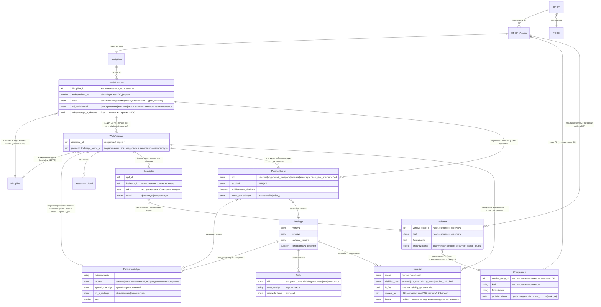

# D06 — Модель данных (платформонезависимая)

> **Домен:** D06 — УМД и контент · **Статус:** draft (черновик для ревью).
> **Что моделируем:** норма-ось академического контура — образовательную программу как **комплект-манифест** и её компоненты. «Кого/сколько учим» (Набор, контингент) — это D05; «что произошло» (ведомости, обязательства) — D04. Здесь только «чему и как».
> **Версионность:** норма версионируется **только вперёд** и **только по изменению** (не по календарю). Год набора — это привязка когорты к версии (живёт в D05), а не сама версия.
> **Нормативка:** ссылки на ФЗ-273 даны для ориентира и **подлежат сверке человеком** (см. `CLAUDE.md`).

---

## 1. Сущности

### 1.1 ОПОП (манифест)

Образовательная программа как **корень-комплект**: собственного содержания почти не несёт, задаёт идентичность и держит ссылки на версии компонентов (ФЗ-273 ст. 2 — «комплекс, представленный в виде учебного плана, …»). Применимость: `[ВУЗ, СПО]`.

| Атрибут | Тип | Описание |
|---|---|---|
| id | UUID | Внутренний идентификатор |
| напр_спец | ссылка | Направление/специальность (в границах лицензии, D02) |
| profil | string? | Профиль / направленность — различитель ОПОП внутри направления |
| forma_obucheniya | enum | очная / очно-заочная / заочная (допустимый набор задаёт ФГОС, ст. 17) |
| uroven | enum | СПО / бакалавриат / специалитет / магистратура / … |
| fgos_id | ссылка | ФГОС-основание (`standards/fgos`) |
| kvalifikaciya | string | Присваиваемая квалификация (производна от ФГОС) |
| status | enum | draft / действует / закрыта-для-набора |
| tekushchaya_versiya_id | ссылка | Текущая версия-манифест |

> **Вариант для ДПО.** Дополнительная профессиональная программа (ДПП) — сестринская сущность того же типа, но норма-основание у неё не ФГОС, а профстандарт/квалтребования (ст. 76; для профпереподготовки с 01.03.2026 — также условия и результаты ФГОС СПО/ВО). Применимость `[ДПО]`. Моделируется отдельной карточкой на следующем шаге.

### 1.2 Версия ОПОП

Сам манифест: неизменный после утверждения снимок ссылок на версии компонентов. Новая версия рождается изменением любого компонента.

| Атрибут | Тип | Описание |
|---|---|---|
| id | UUID | Идентификатор версии |
| opop_id | ссылка | Родительская ОПОП |
| nomer | string | Номер версии (только возрастает) |
| deystvuet_s | date | Начало действия |
| osnovanie | string | Что вызвало версию (новый ФГОС, изменение РПД, приказ) |
| sostav | список ссылок | Закреплённые версии компонентов (учебный план, РПД, ФОС, …) |
| utverzhdenie_id | ссылка? | Документ утверждения (событие документооборота ≠ логическая версия) |

### 1.3 Учебный план

Структурный компонент: перечень, трудоёмкость, последовательность, периоды, формы промежуточной аттестации (ст. 2).

| Атрибут | Тип | Описание |
|---|---|---|
| id | UUID | Идентификатор |
| versiya | string | Версия плана |
| deystvuet_s | date | Начало действия |
| obyom_ze | number | Общий объём (з.е./часы), сверяется с ФГОС |
| dolya_variativnoy | number | Доля части, формируемой участниками |

### 1.4 Строка учебного плана

Дискретная единица плана — конкретная дисциплина/модуль/практика в конкретном периоде.

| Атрибут | Тип | Описание |
|---|---|---|
| id | UUID | Идентификатор |
| plan_id | ссылка | Учебный план |
| disciplina_id | ссылка | Дисциплина/модуль/практика (§1.5). Для строки с `vid_variativnosti = электив` — номинальная/зонтичная запись справочника («Иностранный язык»), а не конкретный вариант; конкретика — на РПД (§1.6) |
| period | int | Семестр/курс размещения |
| trudoyomkost_ze | number | Вес строки. Общий для всех вариантов РПД, если строка — электив (варианты не переопределяют трудоёмкость) |
| chast | enum | обязательная / формируемая участниками. Не применяется («—») к строкам с `vid_variativnosti = факультатив` — факультативы лежат вне деления на части (ст. 2 ФЗ-273 самого термина не знает; деление обязательная/формируемая — про объём, который считается на ФГОС, а факультативы туда не входят) |
| vid_variativnosti | enum | фиксированная / электив / факультатив. Ось согласия обучающегося — ортогональна `chast`. Фиксированная — 1 РПД на строке. Электив — 1..N РПД на строке, обучающийся обязан выбрать ровно одну (термин ФГОС — «избираемая в обязательном порядке»). Факультатив — 1 РПД, обучающийся не обязан осваивать вообще. Хранится на строке (не вычисляется из числа РПД): план обязывает раньше, чем дописаны все РПД-варианты — та же логика, что у `trudoyomkost_ze` (см. Инвариант источника истины §1.6) |
| uchityvaetsya_v_obyome | bool | По умолчанию `true`. `false` — трудоёмкость строки не входит в сумму, сверяемую с объёмом ФГОС (Инвариант 4). Ортогональна `vid_variativnosti`: факультативы — `false`; элективы по физической культуре и спорту — `электив` **и** `false` одновременно (⚠ не менее 328 академических часов, не переводятся в з.е. и не включаются в объём программы бакалавриата — требует сверки по тексту конкретного ФГОС 3++, здесь — общее знание, не проверенная цитата НПА) |

### 1.5 Дисциплина / модуль / практика

Каталожная единица содержания. Переиспользуется строками планов.

| Атрибут | Тип | Описание |
|---|---|---|
| id | UUID | Идентификатор |
| naimenovanie | string | Название |
| tip | enum | дисциплина / МДК / практика / ГИА / научные_исследования (аспирантура — Блок 3, без тематического плана занятий) |

### 1.6 Рабочая программа дисциплины (РПД)

Содержательный компонент нормы: как именно реализуется **одна строка учебного плана** —
цель, результаты освоения, тематический план, условия реализации. Входит в состав версии
ОПОП наравне с учебным планом и ФОС (ФЗ-273 ст. 2 — образовательная программа представлена
в том числе «рабочими программами … дисциплин (модулей)»; ⚠ подлежит сверке человеком).
Применимость: `[ВУЗ, СПО, ДПО, Асп]`, ДО — partial.

**Собственной оси версий не имеет.** «Версия РПД» — это участие конкретной её редакции
в `Версия ОПОП.sostav`; норма версионируется только вперёд и только по изменению (см. 1.2).
Год набора в РПД не хранится — это привязка когорты к версии и живёт в D05.

**Ключевой инвариант источника истины.** РПД **не владеет** трудоёмкостью — она
**проецируется** из «Строки учебного плана» (read-only, пересобирается при смене версии
плана). С формой контроля дисциплинарного уровня иначе: её *тип* (экзамен/зачёт, вес, роль
в рейтинге) решает план при утверждении (§1.11, `istochnik: УП` — УМО/план, не кафедра), но
сама ссылка на запись формы хранится **на РПД**, не на строке (`promezhutochnaya_forma_id`,
ниже) — это и даёт строке возможность иметь несколько РПД с разными формами (электив, §1.4)
или нескольким строкам — намеренно одну общую (группировка профмодуля, §1.11). Норма-основание
содержания — ФГОС; для ДПП — профстандарт/квалтребования.

| Атрибут | Тип | Описание |
|---|---|---|
| id | UUID | Внутренний идентификатор |
| stroka_up_id | ссылка | Строка учебного плана (§1.4) — носитель периода/трудоёмкости/`vid_variativnosti` |
| disciplina_id | ссылка | Дисциплина/модуль/практика (§1.5), которую реализует именно эта РПД. При `vid_variativnosti = фиксированная/факультатив` строки — совпадает с `disciplina_id` строки; при `= электив` — конкретный вариант (английский/немецкий/…), отличный от зонтичной записи строки |
| promezhutochnaya_forma_id | ссылка | Форма контроля (§1.11), закрывающая эту РПД. По умолчанию — своя запись на каждую РПД (в том числе у вариантов электива: независимые события, §1.12). Намеренное совпадение значения у РПД **разных строк** — единственный механизм группировки профмодуля СПО, ничем, кроме совпадения этой ссылки, группа не выражена |
| versiya_opop_id | ссылка | Версия ОПОП, держащая редакцию РПД в `sostav` |
| uroven | enum | СПО / бакалавриат / специалитет / магистратура / ординатура / аспирантура / ДПО — задаёт применимый профиль реквизитов |
| fgos_id | ссылка? | ФГОС-основание (`standards/fgos`); для ДПП — профстандарт/квалтребования |
| razrabotchiki | список ссылок | Разработчики (сотрудники, D07); закрепляются заведующим кафедрой |
| inye_litsa | список | Иные участники разработки/согласования/экспертизы (ручной ввод) |
| tsel | text | Цель программы (ручной ввод / типовой шаблон) |
| zadachi | список | Задачи программы (ручной ввод) |
| status | enum | draft / на_согласовании / утверждена / архив — документооборот, **не** логическая версия |

**Производные поля (read-only, проекция из учебного плана / справочников):**

| Поле | Источник |
|---|---|
| trudoyomkost (часы по видам, ЗЕ) | Строка учебного плана · ФГОС (сверка объёма) |
| nazvanie_discipliny | Дисциплина (справочник, §1.5), через собственный `disciplina_id` РПД |

`formy_kontrolya` в этот список больше не входит — с переносом `promezhutochnaya_forma_id`
на РПД (выше) это уже не проекция строки, а собственное поле РПД; тип по-прежнему диктует план
(см. «Ключевой инвариант источника истины»), но хранится ссылка здесь.

**Разделы содержания** (норма-структура; детальный реестр реквизитов — в машиночитаемом
представлении, не дублируется здесь):

| Раздел | Что несёт |
|---|---|
| Общая характеристика | разработчики, наименования, трудоёмкость *(derived)*, формы контроля *(собственное поле, тип задан планом)*, цель, задачи, межпредметные связи |
| Результаты освоения | компетенции и индикаторы *(derivedFrom ФГОС)*, результаты обучения, оценочные средства |
| Тематический план | периоды, темы, виды занятий, контактная и самостоятельная работа |
| Карточки тем/занятий | детализация занятия: содержание, формы, ресурсы, контрольные точки |
| Условия реализации | учебно-методическое и материально-техническое обеспечение, литература, практическая подготовка |

**Жизненный цикл.** draft → согласование → утверждение → (изменение любого реквизита →
новая редакция → новая `Версия ОПОП`). Архивация — вместе с закрытием версии ОПОП для набора.

**Инварианты.**
- Одна строка учебного плана — 1 РПД при `vid_variativnosti = фиксированная` или `= факультатив`;
  1..N РПД — при `= электив`. Каждая РПД электива — полноценная независимая реализация со своим
  `disciplina_id` и своим `promezhutochnaya_forma_id`, не «черновик варианта».
- `trudoyomkost_ze` — derived-поле, не редактируется в РПД: правка — только через учебный план,
  иначе два источника истины. Вариантам электива на одной строке трудоёмкость не переопределяется.
- Тип `promezhutochnaya_forma_id` РПД не выбирает самостоятельно — он согласован планом при
  утверждении (§1.11, `istochnik: УП`). РПД лишь связывается с уже согласованной записью формы,
  в том числе намеренно разделяя её с РПД других строк (группировка профмодуля).
- Компетенции не вводятся вручную, а ссылаются на узлы ФГОС (`standards/fgos`) через дескриптор результата освоения (§1.10).
- РПД не хранит год набора и собственный номер версии (год — D05, версия — `Версия ОПОП`).

> **Вариант СПО.** Вместо дисциплины — профессиональный модуль / МДК; несколько РПД (МДК +
> практики одного профмодуля) намеренно разделяют один `promezhutochnaya_forma_id` —
> квалификационный экзамен (см. группировку выше и §1.11, §1.12). Профиль — `SPO`.

> **Вариант ДПО (ДПП).** Норма-основание — не ФГОС, а профстандарт/квалтребования
> (⚠ ст. 76; для профпереподготовки с 01.03.2026 — также условия и результаты ФГОС СПО/ВО).
> Появляются поля ЭО и ДОТ. Профиль — `DPO`.

**Машиночитаемое представление.** РПД формализована как **JSON-Двойник** — единый объект,
обслуживающий заполнение, проверку, печать, обратное восстановление и трассировку:

- `standards/rpd/schema/discipline-program-twin.schema.json` — контракт (JSON Schema 2020-12), валидируется в CI наравне с `standards/fgos`;
- `standards/rpd/data/discipline-program-twin.full-template.json` — эталонный шаблон v0.2.0 (91 реквизит, профили по уровням, привязки печати, правила валидации);
- блоки `forms` / `print` / `reverseImport` Двойника — **слой реализации**: в стандарте описываются ссылкой, конкретные привязки живут в реализации (1С / веб), а не в норме.

**Связи.** `derivedFrom` → ФГОС (`standards/fgos`); `partOf` → Версия ОПОП;
`references` → Строка учебного плана; `evidences` ← ФОС / оценочные материалы.

**Формат адресации — JSON Pointer (RFC 6901), не собственная нотация.** Поля
`fieldSource.sourcePath` (внутри одного документа) и `relationLink.from`/`.to`
(между документами, включая внешние — `standards/fgos/data/*.json`) объявлены
в схеме с `format: json-pointer` / `format: uri-reference`. Решение принято по
итогам разбора `inbox/2026-07-06-univercon-fgos-rp-konspekt.md` («Вопрос 1»,
common-ярус): вместо изобретения собственного языка связей — принят
существующий IETF-стандарт (JSON Pointer) для адресации и паттерн JSON
Reference (`file.json#/pointer`) для межфайловых ссылок. ⚠ Формат объявлен как
целевой; 91 существующее значение `sourcePath` в эталонном шаблоне пока в
dot-notation (`curriculum.discipline.name`), не мигрировано — см. открытый
вопрос в CHANGELOG.

### 1.7 Фонд оценочных средств (ФОС)

Версионируемый компонент: чем измеряется достижение индикаторов.

| Атрибут | Тип | Описание |
|---|---|---|
| id | UUID | Идентификатор |
| rpd_id | ссылка | Рабочая программа |
| versiya | string | Версия |
| sredstva | список | Оценочные средства, привязанные к индикаторам |

### 1.8 Компетенция

Компетенция существует двумя разными способами в зависимости от типа — это не
одна сущность с общим хранением, а два разных механизма под одним именем.

**УК / ОПК — не хранятся в D06.** Компетенция целиком живёт внутри документа ФГОС
(`standards/fgos/data/*.json`, вложенные массивы `competencies.universal[]` /
`competencies.general_professional[]`). D06 её не копирует к себе, а адресует
напрямую естественной двойкой `(fgos_id, kod)`. Проверено на реальных данных:
поле `indicators` внутри компетенции ФГОС всегда пусто — стандарт задаёт только
компетенцию, индикатор не входит в состав документа (см. §1.9).

**ПК — хранимая D06-сущность.** Устанавливается ОО на основе профстандарта;
существует только в контексте конкретной версии ОПОП (разные версии ОПОП по
одному направлению могут устанавливать разные ПК).

| Атрибут | Тип | Описание |
|---|---|---|
| versiya_opop_id | ссылка | Версия ОПОП, устанавливающая эту ПК — часть естественного ключа |
| kod | string | Код (например, «ПК-3») — часть естественного ключа вместе с `versiya_opop_id` |
| formulirovka | string | Формулировка (авторский текст ОО) |
| proishozhdenie | object | `{document_id: profstandart_id, put: [funkciya]}` — трудовая функция профстандарта, на основе которой сформулирована ПК |

**Естественный ключ ПК — `(versiya_opop_id, kod)`**, не синтетический UUID: ПК не
существует вне контекста своей версии ОПОП, отдельный глобальный идентификатор
не нужен.

### 1.9 Индикатор достижения компетенции

Всегда **хранимая D06-сущность**, независимо от типа компетенции (УК/ОПК/ПК).
Проверено на реальных данных ФГОС: индикаторы там не заполняются — это
исключительно авторская работа ОО, привязанная к версии ОПОП (см. §1.8).

| Атрибут | Тип | Описание |
|---|---|---|
| versiya_opop_id | ссылка | Версия ОПОП — часть естественного ключа |
| kod | string | Код индикатора (например, «УК-1.1») — часть естественного ключа вместе с `versiya_opop_id` |
| formulirovka | text | Формулировка (авторский текст ОО) |
| proishozhdenie | object | Дискриминированная ссылка на происхождение требования — см. таблицу ниже |

**Естественный ключ индикатора — `(versiya_opop_id, kod)`.** Индикатор физически
живёт в версии ОПОП, не внутри документа нормы — синтетический UUID не нужен.

**`proishozhdenie` — дискриминированная ссылка, не часть первичного ключа.**
Разводит «где хранится» (версия ОПОП, всегда) от «на основании чего
сформулировано» (документ-источник или локальная ПК):

| tip | Реквизиты | Смысл |
|---|---|---|
| `фгос` | `document_id: fgos_id`, `put: [kod_kompetencii]` | Раскрывает компетенцию УК/ОПК данного ФГОС напрямую — локальной строки Компетенции нет (см. §1.8) |
| `пк` | `kod_pk` (в той же `versiya_opop_id`) | Раскрывает локально хранимую ПК (§1.8); происхождение самой ПК от профстандарта уже зафиксировано на строке ПК, здесь не дублируется |

**Инвариант:** `proishozhdenie` не участвует в идентичности индикатора — два
индикатора с одинаковым происхождением, но в разных версиях ОПОП, это разные
строки (разный автор, возможно разная формулировка). Происхождение — атрибут,
не ключ.

### 1.10 Дескриптор результата освоения (РПД)

Хранимая сущность внутри РПД (§1.6, раздел содержания «Результаты освоения»):
конкретное обещание дисциплины по конкретному пункту нормы — «эта РПД формирует
именно это знание/умение/навык ради именно этого индикатора». Автор — разработчик
РПД; заполняется вручную, не выводится автоматически.

| Атрибут | Тип | Описание |
|---|---|---|
| id | UUID | Идентификатор |
| rpd_id | ссылка | Рабочая программа (§1.6), которой принадлежит дескриптор |
| indikator_id | ссылка | Индикатор (§1.9, естественный ключ `versiya_opop_id + kod`) — единственная точка входа в норму |
| tekst | text | Что именно должен знать/уметь/чем владеть обучающийся (ручной ввод) |
| vklad | enum | Тип вклада: формирует / контролирует |

**Дескриптор — хаб, норма не адресуется напрямую.** Карточка занятия
(«формируемые компетенции», §1.12) и ФОС/оценочные средства (§1.7) ссылаются на
**дескриптор РПД**, а не на индикатор нормы напрямую. Одна точка входа вместо
нескольких при перевыпуске нормы (новая редакция ФГОС не требует правки ссылок
во всех местах, где компетенция упоминалась, — только пересвязки дескриптора).

**Матрица компетенций — вычисляемый вид, не хранилище.** Сводная таблица
«строка учебного плана × компетенция» **собирается** агрегацией дескрипторов
всех РПД версии ОПОП: `rpd_id → stroka_up_id` (строка плана) и
`indikator_id → proishozhdenie` (какая компетенция — либо `(fgos_id, kod)` из
ФГОС напрямую, либо локальная ПК по `kod_pk` внутри той же версии ОПОП). Не
хранится отдельной M:N-таблицей. Дублирующего источника истины не возникает:
правда лежит в дескрипторах и индикаторах, матрица — их проекция для чтения
(аккредитация, полнота покрытия).

### 1.11 Форма контроля (как норма)

Форма контроля — **элемент нормы** (описание того, что должно быть проверено). Это НЕ
экземпляр проверки (последний живёт в D04 как факт: конкретная попытка на конкретном
событии). Одна норма — много фактов.

Атрибуты (наследуются из academic-concept v1.4 §3.2, форма контроля как единая
сущность с осями):

| Атрибут | Тип | Описание |
|---|---|---|
| id | UUID | Идентификатор |
| naimenovanie | string | «Модульный контроль темы 3», «Экзамен по дисциплине D», «Курсовая по D» |
| uroven | enum | занятие / тема / тематический_модуль / дисциплина (промежуточная аттестация) / программа (ГИА) |
| sposob_zakrytiya | enum | прямой (запись делается на событии) / агрегированный (вычисляется из нижележащих) |
| rol_v_reytinge | enum | обязательная (для проходного порога) / повышающая (сверх порога) |
| ves | number | Условные баллы |
| tip_ocenki | enum | балл-100 / зачёт-незачёт / оценка-5 / комплексная |
| istochnik | enum | РПД (уровни занятие/тема/тематический_модуль — решает кафедра, внутренний контроль тематического плана) / УП (уровни дисциплина [промежуточная аттестация] / программа [ГИА] — решает план/УМО при утверждении, кафедра не выбирает) |
| istochnik_id | ссылка? | Для `istochnik: РПД` — обязательна, единственный путь найти владельца. Для `istochnik: УП` — необязательна: состав «каких строк/РПД касается» уже вычисляется обратным поиском по `promezhutochnaya_forma_id` (§1.6), дублировать нечем |

⚠ До этой правки уровень «дисциплина» был отнесён к `istochnik: РПД` — то есть буквально
утверждал, что форму промежуточной аттестации решает кафедра при написании РПД. Это противоречило
уже написанному в §1.6 («РПД не владеет … формами контроля — она их проецирует»). Исправлено:
только тематический (внутридисциплинарный) контроль — дело РПД; дисциплина и программа — дело плана.
Ранее значение `модуль` здесь означало тематический раздел внутри дисциплины (модульный контроль
темы) — переименовано в `тематический_модуль`, чтобы не путать с профессиональным модулем СПО,
у которого нет собственного уровня формы контроля — он выражается расшариванием
`promezhutochnaya_forma_id` между РПД разных строк (§1.6), а не отдельным значением `uroven`.

**Три оси форм контроля** (из Дидактикон Блок III):

| Ось | Значения | Смысл |
|---|---|---|
| `role_in_rating` | required / bonus | обязательная для порога / повышающая |
| `assignment_mode` | all / per_student | назначается всем зарегистрированным / индивидуально |
| `time_model` | inline / extended | должна уложиться в событие (с `duration_minutes`) / переживает событие (с `due_at`) |

### 1.12 Запланированное учебное событие

Родовое понятие: генератор обязательств в академическом контуре, **зафиксированный на
уровне плана** (не в момент проведения). Термин совпадает с academic-concept v1.4 §4.
Виды: занятие / модульный контроль / экзамен / зачёт / курсовая / день практики /
ГИА.

Ключевой принцип (из доклада §4): **«Расписание не создаёт события — оно их
разворачивает».** Событие возникает в плане (в РПД или УП), расписание (D14) его
переносит в календарь и ресурсы, реализация (D04) фиксирует факт.

| Атрибут | Тип | Описание |
|---|---|---|
| id | UUID | Идентификатор |
| vid | enum | занятие / модульный_контроль / экзамен / зачёт / курсовая / день_практики / ГИА |
| istochnik | enum | РПД (занятие / модульный_контроль — из тематического плана) / УП (экзамен / зачёт / курсовая / ГИА — из плана, зеркалит §1.11) |
| istochnik_id | ссылка? | Ссылка на РПД (для «занятие»/«модульный_контроль») или на строку УП (для ГИА); для «экзамен»/«зачёт»/«курсовая» — необязательна, см. правило генерации ниже |
| forma_kontrolya_id | ссылка? | Форма контроля (§1.11), которая закрывается этим событием (может отсутствовать для чисто дисциплинарных занятий) |

**Правило генерации для «экзамен»/«зачёт»/«курсовая» (промежуточная аттестация):** одно
событие **на каждое отличающееся значение** `promezhutochnaya_forma_id`, встречающееся среди
РПД, а не одно на РПД и не одно на строку. Из этого правила без дополнительной логики следуют
оба разобранных случая:
- **Электив** (§1.4/§1.6): у N РПД одной строки — N разных `promezhutochnaya_forma_id`
  (по умолчанию, каждая РПД своя) → N независимых событий; в траектории (D05) обучающегося
  окажется ровно одно, по его выбору.
- **Профмодуль СПО** (§1.6): у N РПД разных строк — намеренно один и тот же
  `promezhutochnaya_forma_id` → одно событие, закрывающее все N обязательств разом (пример
  «1..N обязательств одновременно» уже описан в D04 §1.1 «Аттестационное событие»).
| paket_id | ссылка? | Пакет занятия (§1.13) — для видов «занятие», «день_практики» и т.п. |
| tema_id | ссылка? | Тема тематического плана (для «занятие», «модульный_контроль») |
| ozhidaemaya_dlitelnost | duration | пара / рабочий день / N часов |
| forma_provedeniya | enum | очно / онлайн / гибрид (атрибут, не отдельный класс — по §4.3 academic-concept) |

**Инвариант:** одно занятие в расписании (слот D14) может содержать **1..N**
запланированных учебных событий с разными правилами формирования состава
(пример: само занятие + модульный контроль, где второй — не для всех).

**Как формируется состав события:** пересечение (кто имеет событие в траектории D05)
× (кто активен на дату). Формулировка из §4 доклада: «состав каждого учебного события
формируется в момент его наступления, из тех, у кого это событие стоит в
траектории и чей статус позволяет на нём быть». Черновой состав вычисляется на
старте, факт затвердевает через буфер (D04).

### 1.13 Пакет занятия

Пакет — **манифест события**, «картридж» (аналогия из §7 доклада): знает о дисциплине,
теме, виде, форме контроля; **не знает** группу, дату, преподавателя. Один пакет —
много запусков на разных группах, в разных семестрах, у разных преподавателей.

Модель наследует ключевые решения из `lesson-package-concept.md` (в inbox):

| Атрибут | Тип | Описание |
|---|---|---|
| id | UUID | Стабильный идентификатор |
| versiya | string | Semver методической редакции |
| revisiya | string | Технический sha сборки |
| schema_versiya | string | Версия схемы описания пакета |
| privyazka.opop | ссылка | ОПОП |
| privyazka.plan | ссылка | Учебный план |
| privyazka.rpd | ссылка | РПД / РПП |
| privyazka.tema | ссылка? | Тема тематического плана |
| privyazka.vid_zanyatiya | enum | Лекция / семинар / практика / лаба / … |
| ozidayemaya_dlitelnost | duration | pair / lesson / academic_day (§4 lesson-package) |
| tselii | список | Цели именно этого занятия |
| kompetencii | список ссылок | Осваиваемые индикаторы (стык с §1.9) |
| materials | список ссылок | Материал (§1.15) со `scope: пакет`, привязанный к этому пакету — не произвольный список URL |
| formy_kontrolya | список ссылок | Ссылки на формы контроля (§1.11), возможные внутри события |
| gates | список ссылок | Gate (§1.14) — на входе и выходе события |
| istochniki_dannykh | enum | base (из ИС) / overlay (педагог) / runtime (LMS) — три слоя данных |

**Инварианты пакета:**

1. **Стейтлесс.** Пакет ничего не помнит между запусками. Прогресс, оценки, факты —
   в D04.
2. **Атомарен.** Один пакет = одна единица учебного процесса (одно занятие / один
   экзамен / один день практики).
3. **Переиспользуем.** Пакет применяется на многих запусках, пока РПД актуальна.
4. **Три источника данных** (base + overlay + runtime): база собирается из ИС,
   overlay — правки педагога, runtime — контекст запуска (группа, дата,
   преподаватель) подставляется в момент проведения.

### 1.14 Gate

Первоклассная сущность: **шлюз, блокирующий проход по занятию** до выполнения условия.
Тексты gate — из централизованной библиотеки (вуз/кафедра), ad-hoc — исключение.
Версионирование обязательно: факт прохождения привязан к версии текста.

| Атрибут | Тип | Описание |
|---|---|---|
| id | UUID | Идентификатор |
| vid | enum | entry-test / consent / briefing / readiness / form / attendance |
| tekst | text | Текст gate (для consent, briefing, readiness) |
| tekst_versiya | string | Версия текста — на неё ссылается факт прохождения |
| razmeshchenie | enum | entry (перед началом) / exit (перед завершением) / interstitial (между смысловыми частями — отложено, не MVP) |
| yur_znachimost | enum? | Обычный / требует бумажной подписи (для инструктажей ТБ) |

**Инвариант:** пакет **стейтлесс**. Факт прохождения gate хранится в D04, а не в
пакете. При запуске пакет спрашивает D04: «эти gate уже пройдены этим студентом?».

### 1.15 Материал

Контент-слой D06 (упомянут как отложенный в CHANGELOG, теперь формализован).
**D06 хранит только привязку, не сам контент** — источник (архивные
`concept-eios.md`, `didakticon-block3-event-lifecycle.md`): контент — лист, не
структура; иерархию (дисциплина → тема → занятие) держит D06 через уже
существующие тематический план (§1.6) и Пакет (§1.13), а не отдельное дерево
контента. Сам файл/курс лежит статикой на хостинге или в LRS-совместимом
плеере — вне D06.

| Атрибут | Тип | Описание |
|---|---|---|
| id | UUID | Идентификатор |
| scope | enum | дисциплина / пакет — уровень привязки (см. ниже) |
| privyazka | ссылка | При `scope: дисциплина` — РПД (§1.6) + тема тематического плана; при `scope: пакет` — Пакет занятия (§1.13) |
| visibility_gate | enum | enrolled / pre_event / during_event / teacher_unlocked — см. «Четыре уровня видимости» |
| is_fos | bool | Материал входит в ФОС (программа, банк вопросов, критерии, шкалы) |
| content_ref | ссылка (URI) | Адрес контента — статика или LRS-плеер. D06 не хранит сам контент, только эту ссылку |
| format | enum? | Подсказка плееру о формате (`cmi5` / `scorm` / `static`) — не влияет на норму, только на то, чем это открыть; необязательное поле реализации, не часть контракта D06 |

**Материалы дисциплины vs материалы пакета:**

```
Дисциплина (РПД)
  ├── материалы дисциплины (scope: дисциплина, visibility_gate: enrolled)
  └── Пакет занятия N (§1.13)
        ├── материалы пакета (scope: пакет, visibility_gate: pre_event / during_event / teacher_unlocked)
        └── формы контроля события (§1.11)
```

`Пакет.materials` (§1.13) — список ссылок именно на Материал этого вида,
не произвольный список URL, как было сформулировано раньше.

**Четыре уровня видимости** (`visibility_gate`):

| Уровень | Когда виден | Примеры |
|---|---|---|
| `enrolled` | с зачисления на дисциплину | программа, ФОС, банк вопросов, темы письменных работ, критерии, шкалы, литература |
| `pre_event` | с открытия события | материалы для подготовки, чтения, overlay педагога |
| `during_event` | после регистрации в событии | слайды, текст контрольной, конспект |
| `teacher_unlocked` | явным действием педагога | разборы решений, доп. материалы |

**Норма видимости по состоянию события** (состояние и регистрация — факты D04,
но какие уровни видны при каком их сочетании — норма D06):

| Состояние события | Регистрация | Видимые уровни |
|---|---|---|
| запланировано | — | enrolled + pre_event |
| регистрация, не отмечен | нет | enrolled + pre_event |
| регистрация, отмечен | да | enrolled + pre_event + during_event |
| регистрация_закрыта, отмечен | да | enrolled + pre_event + during_event |
| регистрация_закрыта, не отмечен | нет | enrolled + pre_event |
| идёт, отмечен | да | enrolled + pre_event + during_event (+ teacher_unlocked) |
| идёт, не отмечен | нет | enrolled + pre_event |
| завершено, отмечен | да | enrolled + pre_event + during_event (read-only) |
| завершено, не отмечен | нет | enrolled + pre_event |
| перенесено | — | enrolled |

**Инварианты.**
- `is_fos = true` ⟹ `visibility_gate = enrolled`. Оценочные материалы нельзя
  спрятать за более поздний гейт — конкретная выборка вопросов в попытке
  (рандомизация) это ограничение не нарушает, она не часть видимости пакета.
- **SCORM — принимаемое исключение, не целевой формат.** Атомарная единица
  D06 — занятие (Пакет, §1.13), а не курс; SCORM в реальных инструментах
  авторинга почти всегда экспортируется одним пакетом на весь курс (даже
  когда сам формат формально это не требует) — подгонять его под привязку на
  занятие означало бы либо ломать атомарность Пакета, либо резать курсы на
  части, которые никто в реальности так не готовит. Правило сосуществования
  (по `concept-eios.md`): легаси-курсы из авторинг-тулзов — SCORM, `scope:
  дисциплина`, привязка одним куском; новый контент, авторимый под наш формат
  занятия, — мелко, `scope: пакет`. `format` в схеме — не жёсткий enum на
  будущее, а подсказка плееру для уже принятого легаси; протокол
  воспроизведения — граница с D12/реализацией, не предмет нормы D06.

---

## 2. Жизненные циклы

### 2.1 Версия ОПОП (только вперёд)

```
изменение компонента → новая Версия ОПОП → утверждение → действует
```

- Нет изменений компонентов — новой версии нет; несколько наборов делят одну версию.
- После утверждения версия неизменна; правка = следующая версия.
- Ежегодное переутверждение без изменений — новое `utverzhdenie_id`, та же логическая версия.

### 2.2 Статусы ОПОП

```
draft → действует → закрыта-для-набора
```

«Закрыта-для-набора» не отменяет версию: пристёгнутые когорты доучиваются по своей.

---

## 3. Инварианты

1. ОПОП существует только в границах лицензии (D02): специальность × форма × адрес.
2. УК и ОПК импортированы из ФГОС и локально неизменяемы; ПК устанавливает ОО на основе профстандарта.
3. Версия ОПОП неизменна после утверждения; изменение компонента → новая версия (только вперёд).
4. Объём учебного плана равен объёму ФГОС с учётом долей обязательной и формируемой частей —
   сумма считается только по строкам с `uchityvaetsya_v_obyome = true` (§1.4); факультативы и
   элективы по физической культуре и спорту (⚠ норма конкретного ФГОС — сверить) в сумму не входят.
5. Каждая компетенция покрыта хотя бы одним дескриптором результата освоения (§1.10)
   в составе РПД версии ОПОП; матрица покрытия — вычисляемый вид над дескрипторами,
   не отдельное хранилище (полнота покрытия).
6. Каждый индикатор обеспечен хотя бы одним оценочным средством в ФОС.
7. ОПОП-манифест не содержит собственного учебного текста — только ссылки на версии компонентов.
8. Набор (D05) пристёгнут ровно к одной Версии ОПОП.
9. **План учебных событий формируется в двух местах:** в РПД (внутри дисциплины) и в
   строках УП (уровня программы). Единый план из двух уровней.
10. **Форма контроля — норма, не факт.** Одна форма контроля D06 порождает множество
    попыток проверки — но каждая попытка живёт в D04 как отдельная запись. Правка
    факта — только через сторно (D04), но не через изменение формы контроля.
11. **Пакет — стейтлесс.** Пакет знает о норме (дисциплина / тема / форма контроля /
    материалы / gates), но НЕ знает о runtime-контексте (группа / дата / преподаватель).
    Все факты запуска — в D04.
12. **Расписание не создаёт события.** События появляются в плане (РПД / УП); D14
    только назначает им время, аудиторию, преподавателя. Один слот D14 может
    покрывать 1..N запланированных событий D06.
13. **Дескриптор — единственная точка входа в норму.** Карточка занятия и ФОС
    ссылаются на дескриптор РПД (§1.10), не на индикатор ФГОС напрямую. Перевыпуск
    редакции ФГОС не требует правки ссылок во всех потребителях — только пересвязки
    дескриптора.
14. **УК/ОПК не хранятся в D06 — только ПК.** Компетенция УК/ОПК адресуется
    естественной двойкой `(fgos_id, kod)` прямо в `standards/fgos/data/*.json`;
    локальной строки в D06 не заводится. ПК — единственный тип компетенции,
    хранимый локально (§1.8), потому что устанавливается самой ОО, а не
    существует в готовом виде во внешнем документе.
15. **Индикатор всегда хранится в ОПОП, никогда — в документе нормы.** ФГОС не
    задаёт индикаторов (проверено на реальных данных — поле всегда пусто).
    Естественный ключ индикатора — `(versiya_opop_id, kod)`; происхождение
    (`proishozhdenie`) — атрибут-дискриминатор, не часть ключа (§1.9).
16. **Электив — 1..N РПД на одной строке, не N строк.** Выбор варианта (иностранный язык,
    физическая культура) выражается несколькими РПД с общим `stroka_up_id`, разными
    `disciplina_id` и, по умолчанию, разными `promezhutochnaya_forma_id` (§1.6). Строка
    остаётся одна — иначе трудоёмкость варианта задвоилась бы в сумме против ФГОС (Инвариант 4).
17. **Профмодуль СПО — не отдельная сущность, а расшаренный `promezhutochnaya_forma_id`.**
    Несколько строк (МДК + практики модуля) со своими независимыми РПД намеренно указывают на
    одну и ту же запись формы контроля — этого совпадения достаточно, чтобы получить один
    квалификационный экзамен на группу (§1.6, §1.11, §1.12); отдельный справочник
    «Профессиональный модуль» не заводится, пока не появится потребность вне этой группировки
    (код/название модуля, требование к суммарной трудоёмкости) — сейчас имя экзамена в
    `naimenovanie` формы контроля этой роли достаточно.
18. **`vid_variativnosti` — хранимое поле строки, не вычисляемый вид.** В отличие от матрицы
    компетенций (Инвариант 5), количество РПД на строке нельзя использовать как источник этого
    признака: план обязывает («здесь будет выбор») раньше, чем дописана хотя бы одна из РПД-вариантов.
19. **Блоки печатной формы плана (Б1.О/Б1.В/ФТД/ПМ и т.п.) — вычисляемый вид**, не хранимая
    иерархия. Выводятся группировкой по `tip` (§1.5) × `chast` × `uchityvaetsya_v_obyome`
    (§1.4) в момент печати — кроме профмодуля (Инвариант 17), где группировка не выводится из
    атрибутов одной строки и хранится через совпадение `promezhutochnaya_forma_id`.

---

## 4. Контракты с другими доменами

### D06 ↔ D02 (лицензирование)
Допустимое множество ОПОП ограничено реестровой записью лицензии (ст. 91): специальность/направление, форма, адрес. ОПОП вне этих границ — невалидна.

### D06 ↔ standards/fgos
ОПОП ссылается на ФГОС (`fgos_id`). УК/ОПК и объём/срок импортируются и считаются заданными; локальная правка запрещена (инвариант 2, 4).

### D06 → D05 (управление контингентом)
**Точка сцепки двух осей.** Набор несёт ссылку `opop_versiya_id` (связь «многие-к-одному»: много наборов → одна версия). Пин устанавливается приёмной кампанией по году набора и далее только перецепляется событием траектории (перевод, смена формы, восстановление). **Эту ссылку добавляем на шаге 2 в D05.**

### D06 ↔ D04 (образовательная деятельность)
D04 читает структуру пристёгнутой Версии ОПОП как источник обязательств: строки учебного плана → элементы траектории → обязательства. Освоение компетенции (факт D04) сверяется с индикаторами **пристёгнутой** версии, а не текущей. Потребление — снимком, по паттерну дома.

**Форма контроля — норма vs факт.** D06 владеет нормой (§1.11): «должен быть модульный
контроль темы 3, вес 30, порог 60%». D04 владеет фактом: конкретная попытка на
конкретном событии с оценкой. Одна норма D06 порождает множество фактов D04.

### D06 → D14 (расписание)

D14 разворачивает **план запланированных событий** D06 на сетку ресурсов (аудитории,
преподаватели, потоки). Контракт по докладу §4: «Расписание не создаёт события — оно
их разворачивает».

Что передаётся:
- Список запланированных учебных событий (§1.12) на период
- Их привязки (дисциплина / тема / вид / форма контроля / пакет)
- Правила формирования состава (общее правило — «кто имеет это событие в траектории»)

Что НЕ передаётся:
- Материалы, формы контроля, gates — их D14 не касается; они читаются D04 напрямую
  из пакета при проведении

**Слот расписания D14** — временной интервал + ресурсы — покрывает 1..N
запланированных событий D06. Пример: слот «10:30–12:00 ауд. 301 гр. БИ-25-1 преп.
Иванов» может содержать событие «занятие № 14 по D» + событие «модульный контроль
темы 3» (у второго — свой состав, часть студентов уже перезачла).

### D06 → D05 (траектория)

D05 читает план учебных событий D06 (РПД + УП) для формирования **траектории**
обучающегося: развёртка УП с учётом его выборов и перезачётов. Траектория знает,
какие события предстоят этому обучающемуся.

Состав события формируется как пересечение (траектория обучающегося содержит это
событие) × (статус контингента активен на дату).

---

## 5. ERD (mermaid)



> Внешняя сцепка (за пределами D06):
> - `D05.Набор }o--|| OPOP_Version : "пин по году набора"`
> - `D14.Слот }o--o{ PlannedEvent : "разворачивает 1..N событий на слот"`
> - `D05.Траектория }o--o{ PlannedEvent : "включает события для обучающегося"`
> - `D04.УчебноеСобытие(факт) }o--|| PlannedEvent : "реализация плана"`
> - `Indicator.proishozhdenie }o--|| standards/fgos.Competency : "адресуется двойкой (fgos_id, kod), если основание — ФГОС; локальной строки Компетенции для УК/ОПК в D06 нет"`
>
> **Матрица компетенций не показана как сущность ERD** — это вычисляемый вид
> (`StudyPlanLine × Competency`, агрегация через `WorkProgram → Descriptor →
> Indicator → Competency`), а не хранимая таблица.
>
> **Профессиональный модуль СПО и блоки печатной формы плана (Б1.О/Б1.В/ФТД/…)
> тоже не показаны как сущности** — по тем же причинам (Инварианты 17, 19): первое
> — совпадение `WorkProgram.promezhutochnaya_forma_id` у РПД разных строк, второе —
> группировка `StudyPlanLine` по `tip`×`chast`×`uchityvaetsya_v_obyome` в момент печати.
