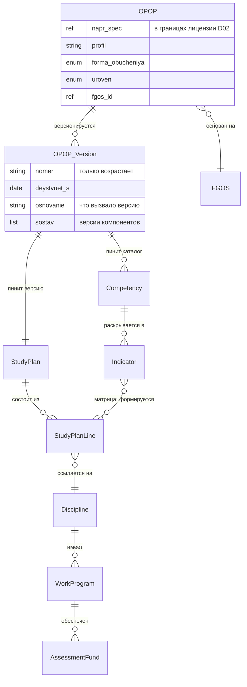

# D06 — Модель данных (платформонезависимая)

> **Домен:** D06 — УМД и контент · **Статус:** draft (черновик для ревью).
> **Что моделируем:** норма-ось академического контура — образовательную программу как **комплект-манифест** и её компоненты. «Кого/сколько учим» (Набор, контингент) — это D05; «что произошло» (ведомости, обязательства) — D04. Здесь только «чему и как».
> **Версионность:** норма версионируется **только вперёд** и **только по изменению** (не по календарю). Год набора — это привязка когорты к версии (живёт в D05), а не сама версия.
> **Нормативка:** ссылки на ФЗ-273 даны для ориентира и **подлежат сверке человеком** (см. `CLAUDE.md`).

---

## 1. Сущности

### 1.1 ОПОП (манифест)

Образовательная программа как **корень-комплект**: собственного содержания почти не несёт, задаёт идентичность и держит ссылки на версии компонентов (ФЗ-273 ст. 2 — «комплекс, представленный в виде учебного плана, …»). Применимость: `[ВУЗ, СПО]`.

| Атрибут | Тип | Описание |
|---|---|---|
| id | UUID | Внутренний идентификатор |
| напр_спец | ссылка | Направление/специальность (в границах лицензии, D02) |
| profil | string? | Профиль / направленность — различитель ОПОП внутри направления |
| forma_obucheniya | enum | очная / очно-заочная / заочная (допустимый набор задаёт ФГОС, ст. 17) |
| uroven | enum | СПО / бакалавриат / специалитет / магистратура / … |
| fgos_id | ссылка | ФГОС-основание (`standards/fgos`) |
| kvalifikaciya | string | Присваиваемая квалификация (производна от ФГОС) |
| status | enum | draft / действует / закрыта-для-набора |
| tekushchaya_versiya_id | ссылка | Текущая версия-манифест |

> **Вариант для ДПО.** Дополнительная профессиональная программа (ДПП) — сестринская сущность того же типа, но норма-основание у неё не ФГОС, а профстандарт/квалтребования (ст. 76; для профпереподготовки с 01.03.2026 — также условия и результаты ФГОС СПО/ВО). Применимость `[ДПО]`. Моделируется отдельной карточкой на следующем шаге.

### 1.2 Версия ОПОП

Сам манифест: неизменный после утверждения снимок ссылок на версии компонентов. Новая версия рождается изменением любого компонента.

| Атрибут | Тип | Описание |
|---|---|---|
| id | UUID | Идентификатор версии |
| opop_id | ссылка | Родительская ОПОП |
| nomer | string | Номер версии (только возрастает) |
| deystvuet_s | date | Начало действия |
| osnovanie | string | Что вызвало версию (новый ФГОС, изменение РПД, приказ) |
| sostav | список ссылок | Закреплённые версии компонентов (учебный план, РПД, ФОС, …) |
| utverzhdenie_id | ссылка? | Документ утверждения (событие документооборота ≠ логическая версия) |

### 1.3 Учебный план

Структурный компонент: перечень, трудоёмкость, последовательность, периоды, формы промежуточной аттестации (ст. 2).

| Атрибут | Тип | Описание |
|---|---|---|
| id | UUID | Идентификатор |
| versiya | string | Версия плана |
| deystvuet_s | date | Начало действия |
| obyom_ze | number | Общий объём (з.е./часы), сверяется с ФГОС |
| dolya_variativnoy | number | Доля части, формируемой участниками |

### 1.4 Строка учебного плана

Дискретная единица плана — конкретная дисциплина/модуль/практика в конкретном периоде.

| Атрибут | Тип | Описание |
|---|---|---|
| id | UUID | Идентификатор |
| plan_id | ссылка | Учебный план |
| disciplina_id | ссылка | Дисциплина/модуль/практика |
| period | int | Семестр/курс размещения |
| trudoyomkost_ze | number | Вес строки |
| chast | enum | обязательная / формируемая участниками |
| forma_kontrolya | enum | экзамен / зачёт / … (промежуточная аттестация) |

### 1.5 Дисциплина / модуль / практика

Каталожная единица содержания. Переиспользуется строками планов.

| Атрибут | Тип | Описание |
|---|---|---|
| id | UUID | Идентификатор |
| naimenovanie | string | Название |
| tip | enum | дисциплина / МДК / практика / ГИА |

### 1.6 Рабочая программа дисциплины (РПД)

Версионируемый компонент: результаты обучения по дисциплине.

| Атрибут | Тип | Описание |
|---|---|---|
| id | UUID | Идентификатор |
| disciplina_id | ссылка | Дисциплина |
| versiya | string | Версия |
| rezultaty | список | Результаты обучения (знать / уметь / владеть) |

### 1.7 Фонд оценочных средств (ФОС)

Версионируемый компонент: чем измеряется достижение индикаторов.

| Атрибут | Тип | Описание |
|---|---|---|
| id | UUID | Идентификатор |
| rpd_id | ссылка | Рабочая программа |
| versiya | string | Версия |
| sredstva | список | Оценочные средства, привязанные к индикаторам |

### 1.8 Компетенция

| Атрибут | Тип | Описание |
|---|---|---|
| id | UUID | Идентификатор |
| tip | enum | УК / ОПК / ПК |
| kod | string | Код (например, ПК-3) |
| formulirovka | string | Формулировка |
| istochnik | enum | ФГОС (для УК/ОПК) / профстандарт (для ПК) |

### 1.9 Индикатор достижения компетенции

| Атрибут | Тип | Описание |
|---|---|---|
| id | UUID | Идентификатор |
| kompetenciya_id | ссылка | Компетенция |
| kod | string | Код индикатора |
| formulirovka | string | Формулировка (определяется в ОПОП) |

### 1.10 Матрица компетенций

Связь «многие-ко-многим»: чем формируется каждая компетенция/индикатор.

| Атрибут | Тип | Описание |
|---|---|---|
| indikator_id | ссылка | Индикатор |
| stroka_plana_id | ссылка | Строка учебного плана (дисциплина) |
| vklad | enum? | Тип вклада (формирует / контролирует) |

---

## 2. Жизненные циклы

### 2.1 Версия ОПОП (только вперёд)

```
изменение компонента → новая Версия ОПОП → утверждение → действует
```

- Нет изменений компонентов — новой версии нет; несколько наборов делят одну версию.
- После утверждения версия неизменна; правка = следующая версия.
- Ежегодное переутверждение без изменений — новое `utverzhdenie_id`, та же логическая версия.

### 2.2 Статусы ОПОП

```
draft → действует → закрыта-для-набора
```

«Закрыта-для-набора» не отменяет версию: пристёгнутые когорты доучиваются по своей.

---

## 3. Инварианты

1. ОПОП существует только в границах лицензии (D02): специальность × форма × адрес.
2. УК и ОПК импортированы из ФГОС и локально неизменяемы; ПК устанавливает ОО на основе профстандарта.
3. Версия ОПОП неизменна после утверждения; изменение компонента → новая версия (только вперёд).
4. Объём учебного плана равен объёму ФГОС с учётом долей обязательной и формируемой частей.
5. Каждая компетенция покрыта хотя бы одной строкой учебного плана через матрицу (полнота покрытия).
6. Каждый индикатор обеспечен хотя бы одним оценочным средством в ФОС.
7. ОПОП-манифест не содержит собственного учебного текста — только ссылки на версии компонентов.
8. Набор (D05) пристёгнут ровно к одной Версии ОПОП.

---

## 4. Контракты с другими доменами

### D06 ↔ D02 (лицензирование)
Допустимое множество ОПОП ограничено реестровой записью лицензии (ст. 91): специальность/направление, форма, адрес. ОПОП вне этих границ — невалидна.

### D06 ↔ standards/fgos
ОПОП ссылается на ФГОС (`fgos_id`). УК/ОПК и объём/срок импортируются и считаются заданными; локальная правка запрещена (инвариант 2, 4).

### D06 → D05 (управление контингентом)
**Точка сцепки двух осей.** Набор несёт ссылку `opop_versiya_id` (связь «многие-к-одному»: много наборов → одна версия). Пин устанавливается приёмной кампанией по году набора и далее только перецепляется событием траектории (перевод, смена формы, восстановление). **Эту ссылку добавляем на шаге 2 в D05.**

### D06 ↔ D04 (образовательная деятельность)
D04 читает структуру пристёгнутой Версии ОПОП как источник обязательств: строки учебного плана → элементы траектории → обязательства. Освоение компетенции (факт D04) сверяется с индикаторами **пристёгнутой** версии, а не текущей. Потребление — снимком, по паттерну дома.

---

## 5. ERD (mermaid)



> Внешняя сцепка (за пределами D06): `D05.Набор }o--|| OPOP_Version : "пин по году набора"`.
