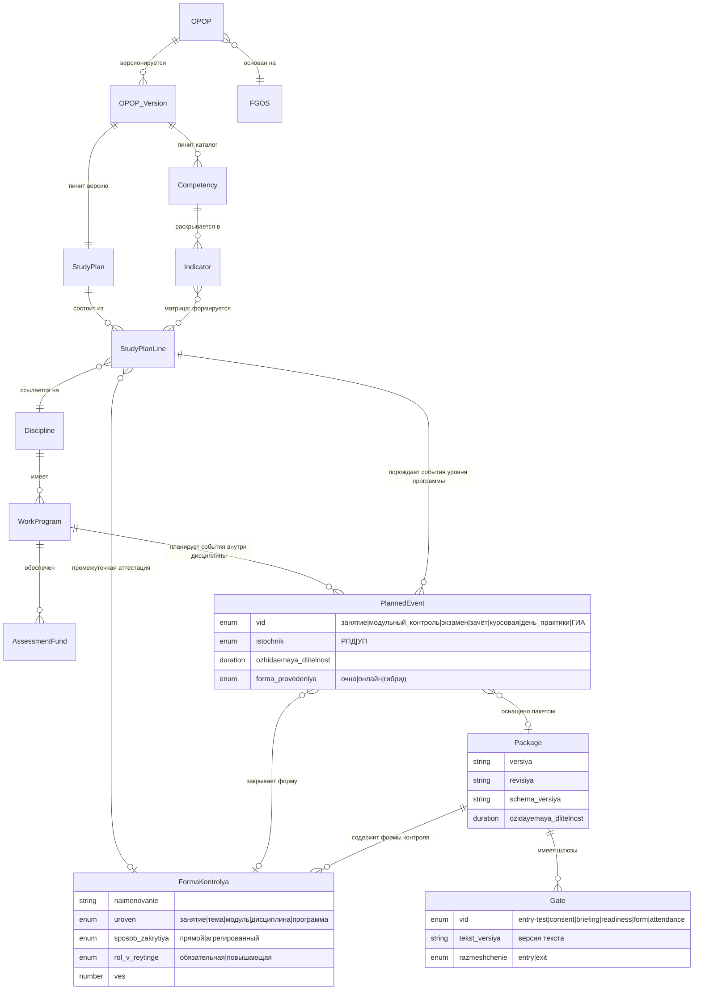

# D06 — Модель данных (платформонезависимая)

> **Домен:** D06 — УМД и контент · **Статус:** draft (черновик для ревью).
> **Что моделируем:** норма-ось академического контура — образовательную программу как **комплект-манифест** и её компоненты. «Кого/сколько учим» (Набор, контингент) — это D05; «что произошло» (ведомости, обязательства) — D04. Здесь только «чему и как».
> **Версионность:** норма версионируется **только вперёд** и **только по изменению** (не по календарю). Год набора — это привязка когорты к версии (живёт в D05), а не сама версия.
> **Нормативка:** ссылки на ФЗ-273 даны для ориентира и **подлежат сверке человеком** (см. `CLAUDE.md`).

---

## 1. Сущности

### 1.1 ОПОП (манифест)

Образовательная программа как **корень-комплект**: собственного содержания почти не несёт, задаёт идентичность и держит ссылки на версии компонентов (ФЗ-273 ст. 2 — «комплекс, представленный в виде учебного плана, …»). Применимость: `[ВУЗ, СПО]`.

| Атрибут | Тип | Описание |
|---|---|---|
| id | UUID | Внутренний идентификатор |
| напр_спец | ссылка | Направление/специальность (в границах лицензии, D02) |
| profil | string? | Профиль / направленность — различитель ОПОП внутри направления |
| forma_obucheniya | enum | очная / очно-заочная / заочная (допустимый набор задаёт ФГОС, ст. 17) |
| uroven | enum | СПО / бакалавриат / специалитет / магистратура / … |
| fgos_id | ссылка | ФГОС-основание (`standards/fgos`) |
| kvalifikaciya | string | Присваиваемая квалификация (производна от ФГОС) |
| status | enum | draft / действует / закрыта-для-набора |
| tekushchaya_versiya_id | ссылка | Текущая версия-манифест |

> **Вариант для ДПО.** Дополнительная профессиональная программа (ДПП) — сестринская сущность того же типа, но норма-основание у неё не ФГОС, а профстандарт/квалтребования (ст. 76; для профпереподготовки с 01.03.2026 — также условия и результаты ФГОС СПО/ВО). Применимость `[ДПО]`. Моделируется отдельной карточкой на следующем шаге.

### 1.2 Версия ОПОП

Сам манифест: неизменный после утверждения снимок ссылок на версии компонентов. Новая версия рождается изменением любого компонента.

| Атрибут | Тип | Описание |
|---|---|---|
| id | UUID | Идентификатор версии |
| opop_id | ссылка | Родительская ОПОП |
| nomer | string | Номер версии (только возрастает) |
| deystvuet_s | date | Начало действия |
| osnovanie | string | Что вызвало версию (новый ФГОС, изменение РПД, приказ) |
| sostav | список ссылок | Закреплённые версии компонентов (учебный план, РПД, ФОС, …) |
| utverzhdenie_id | ссылка? | Документ утверждения (событие документооборота ≠ логическая версия) |

### 1.3 Учебный план

Структурный компонент: перечень, трудоёмкость, последовательность, периоды, формы промежуточной аттестации (ст. 2).

| Атрибут | Тип | Описание |
|---|---|---|
| id | UUID | Идентификатор |
| versiya | string | Версия плана |
| deystvuet_s | date | Начало действия |
| obyom_ze | number | Общий объём (з.е./часы), сверяется с ФГОС |
| dolya_variativnoy | number | Доля части, формируемой участниками |

### 1.4 Строка учебного плана

Дискретная единица плана — конкретная дисциплина/модуль/практика в конкретном периоде.

| Атрибут | Тип | Описание |
|---|---|---|
| id | UUID | Идентификатор |
| plan_id | ссылка | Учебный план |
| disciplina_id | ссылка | Дисциплина/модуль/практика |
| period | int | Семестр/курс размещения |
| trudoyomkost_ze | number | Вес строки |
| chast | enum | обязательная / формируемая участниками |
| promezhutochnaya_forma_id | ссылка | Форма контроля (§1.11) уровня программы: экзамен / зачёт / курсовая / ГИА (промежуточная аттестация; порождает запланированное событие в УП, §1.12) |

### 1.5 Дисциплина / модуль / практика

Каталожная единица содержания. Переиспользуется строками планов.

| Атрибут | Тип | Описание |
|---|---|---|
| id | UUID | Идентификатор |
| naimenovanie | string | Название |
| tip | enum | дисциплина / МДК / практика / ГИА |

### 1.6 Рабочая программа дисциплины (РПД)

Версионируемый компонент: результаты обучения по дисциплине.

| Атрибут | Тип | Описание |
|---|---|---|
| id | UUID | Идентификатор |
| disciplina_id | ссылка | Дисциплина |
| versiya | string | Версия |
| rezultaty | список | Результаты обучения (знать / уметь / владеть) |

### 1.7 Фонд оценочных средств (ФОС)

Версионируемый компонент: чем измеряется достижение индикаторов.

| Атрибут | Тип | Описание |
|---|---|---|
| id | UUID | Идентификатор |
| rpd_id | ссылка | Рабочая программа |
| versiya | string | Версия |
| sredstva | список | Оценочные средства, привязанные к индикаторам |

### 1.8 Компетенция

| Атрибут | Тип | Описание |
|---|---|---|
| id | UUID | Идентификатор |
| tip | enum | УК / ОПК / ПК |
| kod | string | Код (например, ПК-3) |
| formulirovka | string | Формулировка |
| istochnik | enum | ФГОС (для УК/ОПК) / профстандарт (для ПК) |

### 1.9 Индикатор достижения компетенции

| Атрибут | Тип | Описание |
|---|---|---|
| id | UUID | Идентификатор |
| kompetenciya_id | ссылка | Компетенция |
| kod | string | Код индикатора |
| formulirovka | string | Формулировка (определяется в ОПОП) |

### 1.10 Матрица компетенций

Связь «многие-ко-многим»: чем формируется каждая компетенция/индикатор.

| Атрибут | Тип | Описание |
|---|---|---|
| indikator_id | ссылка | Индикатор |
| stroka_plana_id | ссылка | Строка учебного плана (дисциплина) |
| vklad | enum? | Тип вклада (формирует / контролирует) |

### 1.11 Форма контроля (как норма)

Форма контроля — **элемент нормы** (описание того, что должно быть проверено). Это НЕ
экземпляр проверки (последний живёт в D04 как факт: конкретная попытка на конкретном
событии). Одна норма — много фактов.

Атрибуты (наследуются из academic-concept v1.4 §3.2, форма контроля как единая
сущность с осями):

| Атрибут | Тип | Описание |
|---|---|---|
| id | UUID | Идентификатор |
| naimenovanie | string | «Модульный контроль темы 3», «Экзамен по дисциплине D», «Курсовая по D» |
| uroven | enum | занятие / тема / модуль / дисциплина (промежуточная аттестация) / программа (ГИА) |
| sposob_zakrytiya | enum | прямой (запись делается на событии) / агрегированный (вычисляется из нижележащих) |
| rol_v_reytinge | enum | обязательная (для проходного порога) / повышающая (сверх порога) |
| ves | number | Условные баллы |
| tip_ocenki | enum | балл-100 / зачёт-незачёт / оценка-5 / комплексная |
| istochnik | enum | РПД (уровни занятие/тема/модуль/дисциплина) / УП (уровень программы) |
| istochnik_id | ссылка | Ссылка на РПД или строку УП |

**Три оси форм контроля** (из Дидактикон Блок III):

| Ось | Значения | Смысл |
|---|---|---|
| `role_in_rating` | required / bonus | обязательная для порога / повышающая |
| `assignment_mode` | all / per_student | назначается всем зарегистрированным / индивидуально |
| `time_model` | inline / extended | должна уложиться в событие (с `duration_minutes`) / переживает событие (с `due_at`) |

### 1.12 Запланированное учебное событие

Родовое понятие: генератор обязательств в академическом контуре, **зафиксированный на
уровне плана** (не в момент проведения). Термин совпадает с academic-concept v1.4 §4.
Виды: занятие / модульный контроль / экзамен / зачёт / курсовая / день практики /
ГИА.

Ключевой принцип (из доклада §4): **«Расписание не создаёт события — оно их
разворачивает».** Событие возникает в плане (в РПД или УП), расписание (D14) его
переносит в календарь и ресурсы, реализация (D04) фиксирует факт.

| Атрибут | Тип | Описание |
|---|---|---|
| id | UUID | Идентификатор |
| vid | enum | занятие / модульный_контроль / экзамен / зачёт / курсовая / день_практики / ГИА |
| istochnik | enum | РПД (внутри дисциплины) / УП (уровень программы) |
| istochnik_id | ссылка | Ссылка на РПД или строку УП |
| forma_kontrolya_id | ссылка? | Форма контроля (§1.11), которая закрывается этим событием (может отсутствовать для чисто дисциплинарных занятий) |
| paket_id | ссылка? | Пакет занятия (§1.13) — для видов «занятие», «день_практики» и т.п. |
| tema_id | ссылка? | Тема тематического плана (для «занятие», «модульный_контроль») |
| ozhidaemaya_dlitelnost | duration | пара / рабочий день / N часов |
| forma_provedeniya | enum | очно / онлайн / гибрид (атрибут, не отдельный класс — по §4.3 academic-concept) |

**Инвариант:** одно занятие в расписании (слот D14) может содержать **1..N**
запланированных учебных событий с разными правилами формирования состава
(пример: само занятие + модульный контроль, где второй — не для всех).

**Как формируется состав события:** пересечение (кто имеет событие в траектории D05)
× (кто активен на дату). Формулировка из §4 доклада: «состав каждого учебного события
формируется в момент его наступления, из тех, у кого это событие стоит в
траектории и чей статус позволяет на нём быть». Черновой состав вычисляется на
старте, факт затвердевает через буфер (D04).

### 1.13 Пакет занятия

Пакет — **манифест события**, «картридж» (аналогия из §7 доклада): знает о дисциплине,
теме, виде, форме контроля; **не знает** группу, дату, преподавателя. Один пакет —
много запусков на разных группах, в разных семестрах, у разных преподавателей.

Модель наследует ключевые решения из `lesson-package-concept.md` (в inbox):

| Атрибут | Тип | Описание |
|---|---|---|
| id | UUID | Стабильный идентификатор |
| versiya | string | Semver методической редакции |
| revisiya | string | Технический sha сборки |
| schema_versiya | string | Версия схемы описания пакета |
| privyazka.opop | ссылка | ОПОП |
| privyazka.plan | ссылка | Учебный план |
| privyazka.rpd | ссылка | РПД / РПП |
| privyazka.tema | ссылка? | Тема тематического плана |
| privyazka.vid_zanyatiya | enum | Лекция / семинар / практика / лаба / … |
| ozidayemaya_dlitelnost | duration | pair / lesson / academic_day (§4 lesson-package) |
| tselii | список | Цели именно этого занятия |
| kompetencii | список ссылок | Осваиваемые индикаторы (стык с §1.9) |
| materials | список | Ссылки на материалы, разбитые по visibility_gate |
| formy_kontrolya | список ссылок | Ссылки на формы контроля (§1.11), возможные внутри события |
| gates | список ссылок | Gate (§1.14) — на входе и выходе события |
| istochniki_dannykh | enum | base (из ИС) / overlay (педагог) / runtime (LMS) — три слоя данных |

**Инварианты пакета:**

1. **Стейтлесс.** Пакет ничего не помнит между запусками. Прогресс, оценки, факты —
   в D04.
2. **Атомарен.** Один пакет = одна единица учебного процесса (одно занятие / один
   экзамен / один день практики).
3. **Переиспользуем.** Пакет применяется на многих запусках, пока РПД актуальна.
4. **Три источника данных** (base + overlay + runtime): база собирается из ИС,
   overlay — правки педагога, runtime — контекст запуска (группа, дата,
   преподаватель) подставляется в момент проведения.

### 1.14 Gate

Первоклассная сущность: **шлюз, блокирующий проход по занятию** до выполнения условия.
Тексты gate — из централизованной библиотеки (вуз/кафедра), ad-hoc — исключение.
Версионирование обязательно: факт прохождения привязан к версии текста.

| Атрибут | Тип | Описание |
|---|---|---|
| id | UUID | Идентификатор |
| vid | enum | entry-test / consent / briefing / readiness / form / attendance |
| tekst | text | Текст gate (для consent, briefing, readiness) |
| tekst_versiya | string | Версия текста — на неё ссылается факт прохождения |
| razmeshchenie | enum | entry (перед началом) / exit (перед завершением) / interstitial (между смысловыми частями — отложено, не MVP) |
| yur_znachimost | enum? | Обычный / требует бумажной подписи (для инструктажей ТБ) |

**Инвариант:** пакет **стейтлесс**. Факт прохождения gate хранится в D04, а не в
пакете. При запуске пакет спрашивает D04: «эти gate уже пройдены этим студентом?».

---

## 2. Жизненные циклы

### 2.1 Версия ОПОП (только вперёд)

```
изменение компонента → новая Версия ОПОП → утверждение → действует
```

- Нет изменений компонентов — новой версии нет; несколько наборов делят одну версию.
- После утверждения версия неизменна; правка = следующая версия.
- Ежегодное переутверждение без изменений — новое `utverzhdenie_id`, та же логическая версия.

### 2.2 Статусы ОПОП

```
draft → действует → закрыта-для-набора
```

«Закрыта-для-набора» не отменяет версию: пристёгнутые когорты доучиваются по своей.

---

## 3. Инварианты

1. ОПОП существует только в границах лицензии (D02): специальность × форма × адрес.
2. УК и ОПК импортированы из ФГОС и локально неизменяемы; ПК устанавливает ОО на основе профстандарта.
3. Версия ОПОП неизменна после утверждения; изменение компонента → новая версия (только вперёд).
4. Объём учебного плана равен объёму ФГОС с учётом долей обязательной и формируемой частей.
5. Каждая компетенция покрыта хотя бы одной строкой учебного плана через матрицу (полнота покрытия).
6. Каждый индикатор обеспечен хотя бы одним оценочным средством в ФОС.
7. ОПОП-манифест не содержит собственного учебного текста — только ссылки на версии компонентов.
8. Набор (D05) пристёгнут ровно к одной Версии ОПОП.
9. **План учебных событий формируется в двух местах:** в РПД (внутри дисциплины) и в
   строках УП (уровня программы). Единый план из двух уровней.
10. **Форма контроля — норма, не факт.** Одна форма контроля D06 порождает множество
    попыток проверки — но каждая попытка живёт в D04 как отдельная запись. Правка
    факта — только через сторно (D04), но не через изменение формы контроля.
11. **Пакет — стейтлесс.** Пакет знает о норме (дисциплина / тема / форма контроля /
    материалы / gates), но НЕ знает о runtime-контексте (группа / дата / преподаватель).
    Все факты запуска — в D04.
12. **Расписание не создаёт события.** События появляются в плане (РПД / УП); D14
    только назначает им время, аудиторию, преподавателя. Один слот D14 может
    покрывать 1..N запланированных событий D06.

---

## 4. Контракты с другими доменами

### D06 ↔ D02 (лицензирование)
Допустимое множество ОПОП ограничено реестровой записью лицензии (ст. 91): специальность/направление, форма, адрес. ОПОП вне этих границ — невалидна.

### D06 ↔ standards/fgos
ОПОП ссылается на ФГОС (`fgos_id`). УК/ОПК и объём/срок импортируются и считаются заданными; локальная правка запрещена (инвариант 2, 4).

### D06 → D05 (управление контингентом)
**Точка сцепки двух осей.** Набор несёт ссылку `opop_versiya_id` (связь «многие-к-одному»: много наборов → одна версия). Пин устанавливается приёмной кампанией по году набора и далее только перецепляется событием траектории (перевод, смена формы, восстановление). **Эту ссылку добавляем на шаге 2 в D05.**

### D06 ↔ D04 (образовательная деятельность)
D04 читает структуру пристёгнутой Версии ОПОП как источник обязательств: строки учебного плана → элементы траектории → обязательства. Освоение компетенции (факт D04) сверяется с индикаторами **пристёгнутой** версии, а не текущей. Потребление — снимком, по паттерну дома.

**Форма контроля — норма vs факт.** D06 владеет нормой (§1.11): «должен быть модульный
контроль темы 3, вес 30, порог 60%». D04 владеет фактом: конкретная попытка на
конкретном событии с оценкой. Одна норма D06 порождает множество фактов D04.

### D06 → D14 (расписание)

D14 разворачивает **план запланированных событий** D06 на сетку ресурсов (аудитории,
преподаватели, потоки). Контракт по докладу §4: «Расписание не создаёт события — оно
их разворачивает».

Что передаётся:
- Список запланированных учебных событий (§1.12) на период
- Их привязки (дисциплина / тема / вид / форма контроля / пакет)
- Правила формирования состава (общее правило — «кто имеет это событие в траектории»)

Что НЕ передаётся:
- Материалы, формы контроля, gates — их D14 не касается; они читаются D04 напрямую
  из пакета при проведении

**Слот расписания D14** — временной интервал + ресурсы — покрывает 1..N
запланированных событий D06. Пример: слот «10:30–12:00 ауд. 301 гр. БИ-25-1 преп.
Иванов» может содержать событие «занятие № 14 по D» + событие «модульный контроль
темы 3» (у второго — свой состав, часть студентов уже перезачла).

### D06 → D05 (траектория)

D05 читает план учебных событий D06 (РПД + УП) для формирования **траектории**
обучающегося: развёртка УП с учётом его выборов и перезачётов. Траектория знает,
какие события предстоят этому обучающемуся.

Состав события формируется как пересечение (траектория обучающегося содержит это
событие) × (статус контингента активен на дату).

---

## 5. ERD (mermaid)



> Внешняя сцепка (за пределами D06):
> - `D05.Набор }o--|| OPOP_Version : "пин по году набора"`
> - `D14.Слот }o--o{ PlannedEvent : "разворачивает 1..N событий на слот"`
> - `D05.Траектория }o--o{ PlannedEvent : "включает события для обучающегося"`
> - `D04.УчебноеСобытие(факт) }o--|| PlannedEvent : "реализация плана"`
