# Типовая организационная структура ОО: ВО / СПО / ДПО

**Домен:** D07 · **Тип:** лучшая практика — референсная модель
**Источник:** перенесено из `framework.univercon.aplicon.ru/docs/management/edu_org_staffing.md`,
структурировано и адаптировано.

---

Референсная модель штатного расписания, показывающая различия в организационной структуре
между тремя видами образования: **ВО** (университет / академия / институт), **СПО**
(колледж / техникум), **ДПО** (институт повышения квалификации, учебный центр).

Использовать как ориентир при проектировании ИС, обсуждении реорганизации, разработке
локальных нормативных актов о структуре ОО.

## Таблица: соответствие подразделений и должностей

| Группа подразделений | Функция | ВО | СПО | ДПО |
|---|---|---|---|---|
| **Руководство** | Глава организации | Ректор | Директор | Директор |
| Руководство | Заместители | Проректоры (по учебной, научной работе и т.д.) | Заместители директора (по учебной, учебно-производственной работе) | Заместители директора (по учебно-методической работе) |
| **Учебно-административные** | Управление учебным процессом | Учебное управление (УУ) / Учебно-методическое управление (УМУ) | Учебная часть (УЧ) / Учебно-методический отдел (УМО) | Учебная часть (УЧ) / УМО |
| Учебно-административные | Работа со студентами / слушателями | Деканаты (на уровне факультетов / институтов) | Отделение (во главе с зав. отделением) | Отдел (курс) слушателей |
| Учебно-административные | Приём и маркетинг | Приёмная комиссия, Управление по профориентации | Приёмная комиссия, Отдел профориентации | Отдел маркетинга и приёма |
| Учебно-административные | PR и работа с абитуриентами | Управление по связям с общественностью, Пресс-служба | Специалист по PR (часто в отделе профориентации) | Менеджер по маркетингу |
| **Научно-методические и производственные** | Основные учебно-научные единицы | Кафедры | Цикловые комиссии (ЦК) / Отделения | Предметно-цикловые комиссии (ПЦК) / Кафедры |
| Научно-методические | Научно-исследовательская работа | Научно-исследовательская часть (НИЧ), отделы аспирантуры | Обычно отсутствует или в методической службе | Обычно отсутствует |
| Научно-методические | Производственная практика | Отдел практик / Управление по практикам | Отдел учебно-производственной практики | Отдел по связям с предприятиями |
| Научно-методические | Методическая работа | УМУ, Научно-методический совет | Методический кабинет / Методист | Методический отдел |
| **Вспомогательные** | Библиотека | Научная библиотека | Библиотека | Библиотечно-информационный центр |
| Вспомогательные | Информационные технологии | Управление информатизации / IT-отдел | Отдел информационных технологий | Специалист по IT-поддержке |
| Вспомогательные | Хозяйственное обеспечение | Административно-хозяйственная часть (АХЧ) | АХЧ | Хозяйственный отдел |
| Вспомогательные | Ремонт и эксплуатация | Отдел капитального строительства и ремонта | Служба главного механика / энергетика | Функции переданы АХЧ |
| Вспомогательные | Безопасность | Отдел безопасности / Служба режима | Специалист по безопасности / Служба охраны | Сотрудник по безопасности |
| Вспомогательные | Медицинское обслуживание | Медпункт / Студенческая поликлиника | Медпункт | Обычно отсутствует |
| Вспомогательные | Общежитие | Управление общежитиями / Студгородок | Воспитательный отдел (курирует общежития) | Обычно отсутствует |
| **Развитие и поддержка** | Международная деятельность | Управление международных связей | Обычно отсутствует | Очень редко |
| Развитие | Воспитательная работа / Социализация | Управление по воспитательной и социальной работе | Социально-воспитательный отдел | Обычно отсутствует |
| Развитие | Карьера и трудоустройство | Центр карьеры / Отдел трудоустройства | Отдел содействия трудоустройству | Отдел взаимодействия с заказчиками |
| Развитие | Дополнительное образование | Факультет / Институт ДО | Курсы профессиональной подготовки | Основная деятельность |
| **Обязательные службы** | Бухгалтерия | Бухгалтерия / Финансово-экономическое управление | Бухгалтерия | Бухгалтерия |
| Обязательные службы | Отдел кадров | Отдел кадров / Управление персоналом | Отдел кадров | Отдел кадров |
| Обязательные службы | Юридическая служба | Юридический отдел / Правовое управление | Юрисконсульт | Юрист (часто на аутсорсинге) |
| Обязательные службы | Охрана труда | Отдел охраны труда (УОТ) | Инженер по охране труда | Специалист по охране труда |

## Диаграмма: общая структура

```mermaid
flowchart TD
    A[Образовательная организация]
    A --> B[Руководство]
    A --> C[Учебно-административные подразделения]
    A --> D[Научно-методические подразделения]
    A --> E[Вспомогательные подразделения]
    A --> F[Подразделения развития]
    A --> G[Обязательные службы]

    B --> B1[Ректор / Директор]
    B --> B2[Проректоры / Замы директора]

    C --> C1[Учебное управление / Учебная часть]
    C --> C2[Деканаты / Отделения]
    C --> C3[Приёмная комиссия]
    C --> C4[PR и реклама]

    D --> D1[Кафедры / Цикловые комиссии]
    D --> D2[Научно-исследовательская часть]
    D --> D3[Отдел практик]
    D --> D4[Методическая работа]

    E --> E1[Библиотека]
    E --> E2[IT-отдел]
    E --> E3[АХЧ]
    E --> E4[Безопасность]
    E --> E5[Медпункт]
    E --> E6[Общежития]

    F --> F1[Международные связи]
    F --> F2[Воспитательная работа]
    F --> F3[Центр карьеры]
    F --> F4[Дополнительное образование]

    G --> G1[Бухгалтерия]
    G --> G2[Отдел кадров]
    G --> G3[Юридическая служба]
    G --> G4[Охрана труда]
```

## Как использовать эту модель

**При проектировании ИС:**
1. Используйте таблицу как источник для справочника типовых подразделений и должностей.
2. Атрибут «применимость» подразделения (ВО / СПО / ДПО) — параметр, а не жёсткий фильтр:
   реальная ОО может иметь гибрид.
3. Иерархия подразделений — деревом (см. `entities.md` §1.3 «Подразделение»).

**При обсуждении реорганизации:**
1. Проверяйте, какие функции у вас **фактически** выполняются каждым подразделением, — они
   часто мигрируют между блоками с изменением руководства.
2. «Обычно отсутствует» ≠ «не нужно»: если функция обязательна по закону (охрана труда,
   пожарная безопасность), она должна быть у кого-то в обязанностях, даже если нет
   выделенного отдела.

**При разработке ЛНА о структуре ОО:**
1. Используйте формулировки из первого столбца («Управление учебным процессом», «Работа
   со студентами») — они устоялись и совпадают с приказами Минобрнауки / Минпросвещения.
2. Наименования подразделений в разных ОО отличаются («Учебное управление», «УМУ»,
   «Учебная часть») — важна функция, а не название.

## Типовые ошибки при описании оргструктуры

**Смешение функции и подразделения.**
«Приёмная комиссия» в ВО — часто временная сущность на период кампании. Ядро остаётся —
Управление по профориентации. Не путайте временное с постоянным.

**Игнорирование гибридов.**
Малый вуз может иметь одну «Учебную часть», выполняющую функции УМУ, деканатов и отдела
практик одновременно. Не заставляйте гибридов дробиться.

**Прибивание должности к одному подразделению.**
Проректор по учебной работе курирует и УМУ, и деканаты, и приёмную комиссию. Это
управленческая роль, а не глава одного отдела.

**Копирование структуры ВО в СПО и обратно.**
Кафедра в ВО — единица, ведущая и учебную, и научную работу. ЦК в СПО — только учебная
методическая. Не переносите функционал автоматически.

## Что не покрывает эта модель

- **Государственные ОО** (МЧС, МВД, Минобороны) имеют свою специфику — см. соответствующие
  ведомственные приказы.
- **Религиозные ОО** — своя иерархия (духовный руководитель + светская дирекция).
- **Онлайн-школы и полностью цифровые ДПО** — часто без физических подразделений; вместо
  этого — продуктовые команды.
- **Численные нормативы** — сколько должно быть работников на N обучающихся — не даны;
  зависят от уровня, формы, специальности.
