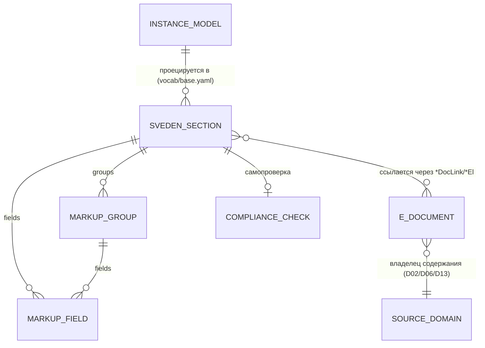

# D11 · Модель данных

## Принцип

D11 не вводит новую модель данных организации — он **проецирует** каноническую
модель (`standards/sveden/schema/instance.schema.yaml`: `org`, `subdivisions`,
`programs[]`, `teachers[]`, `infra`, `docs`, `budget`) в структуру раздела
«Сведения об образовательной организации» по словарю микроразметки
[`standards/sveden/vocab/base.yaml`](../../../standards/sveden/vocab/base.yaml).

Сущности этого документа описывают **проекцию**, а не источник данных.

## Сущности домена

### СведенияРаздел (sveden-секция)

Один из 14 подразделов раздела `/sveden/`, фиксированных Приказом Рособрнадзора № 1493.

| Поле | Тип | Описание |
|---|---|---|
| `slug` | string | Идентификатор подраздела: `common`, `struct`, `document`, `education`, `eduStandarts`, `managers`, `employees`, `objects`, `grants`, `paid_edu`, `budget`, `vacant`, `inter`, `catering` |
| `url` | string | Фиксированный URL: `/sveden/<slug>/` |
| `applicable` | bool | Применим ли подраздел по существу для данной ОО (см. D11-P01, шаг 1) |
| `a11y_required` | bool | Требуется версия для слабовидящих (`itemprop="copy"`) |
| `fields` | list[ПолеРазметки] | Одиночные поля подраздела |
| `groups` | list[ГруппаРазметки] | Повторяющиеся блоки (главный тег на коллекцию) |

### ПолеРазметки

| Поле | Тип | Описание |
|---|---|---|
| `itemprop` | string | Атрибут микроразметки (camelCase, фиксирован Метод. рекомендациями) |
| `from` | string | Путь к данным в канонической модели организации, либо `TBD` |
| `value` | string? | Фактическое значение на рендере; пусто → `"отсутствует"` |
| `status` | enum | `verified` / `TBD` — сверен ли путь `from` со схемой данных |

### ГруппаРазметки

Повторяющийся блок: главный тег на коллекцию, дочерние теги — на поля каждого элемента.

| Поле | Тип | Описание |
|---|---|---|
| `itemprop` | string | Главный тег группы (напр. `structOrgUprav`, `teachingStaff`) |
| `from` | string | Путь к коллекции в данных, оканчивается на `[]` |
| `fields` | list[ПолеРазметки] | Поля одного элемента коллекции |

### ЭлектронныйДокумент (ЭД)

Ссылка на опубликованный документ, на который ссылается один или несколько
подразделов через `*DocLink` / `*El` поля словаря.

| Поле | Тип | Описание |
|---|---|---|
| `key` | string | Ключ в `docs.*` канонической модели (напр. `docs.ustav`, `docs.samoobsledovanie`) |
| `url` | url | Ссылка на опубликованный документ |
| `referenced_by` | list[string] | Какие `itemprop` ссылаются на этот документ (может быть несколько подразделов) |
| `source_domain` | string | Домен-владелец содержания: D02 (устав, лицензия), D06 (УП/РПД/ФОС), D13 (самообследование) |

### ЧекСоответствия

Результат самопроверки одного подраздела перед публикацией / при аудите.

| Поле | Тип | Описание |
|---|---|---|
| `slug` | string | Подраздел |
| `dt_check` | datetime | Дата проверки |
| `total_fields` | int | Всего полей по словарю |
| `present_fields` | int | Заполнено (включая корректное «отсутствует» для неприменимых) |
| `missing_required` | list[string] | Обязательные поля без значения и без разметки «отсутствует» |
| `result` | enum | `pass` / `fail` |

## Инварианты

1. **Источник данных один.** Значения для `/sveden/` берутся из той же канонической
   модели организации, что и для пакета лицензирования (D02). Расхождение между
   `org.license.*` на сайте и в пакете лицензирования — дефект данных, не два
   независимых факта.
2. **Пустое обязательное поле ≠ отсутствие поля.** Поле без данных публикуется со
   значением «отсутствует» (или «нет»), сохраняя `itemprop` — иначе АИС «Мониторинг»
   фиксирует поле как неразмеченное.
3. **Неприменимые подразделы не удаляются из структуры.** Подраздел, неприменимый
   по существу (например, `grants` для коммерческого ДПО), сохраняет фиксированный
   URL и публикуется с полями «отсутствует» — структура раздела фиксирована приказом
   целиком, выборочной публикации подразделов нет.
4. **Append-only словарь.** Новая редакция Приказа № 1493 добавляет подразделы/поля
   поверх `vocab/base.yaml`, не переписывая существующие `itemprop`. Миграции старой
   разметки не требуется.
5. **ЭД — ссылки, не копии.** D11 не дублирует содержание документов из D02/D06/D13;
   публикует ссылки на их актуальные версии. Изменение документа в домене-источнике
   автоматически отражается на сайте при условии стабильности ссылки.

## ERD (схематично)

## Связи с доменами фреймворка

| Домен | Что предоставляет в модель INSTANCE_MODEL |
|---|---|
| D02 | `org.*`, `org.license.*`, `org.accreditation.*`, `docs.ustav` |
| D05 | `programs[].numberStudents`, `programs[].vacant_*` |
| D06 | `programs[].docs.plan`, `programs[].docs.rpd[]`, `programs[].docs.schedule` |
| D07 | `teachers[]` |
| D09 | `budget`, `docs.poryadok_platnyh`, `docs.obrazec_dogovora`, `docs.stoimost_obucheniya` |
| D13 | `docs.samoobsledovanie`, `docs.predpisaniya` |
