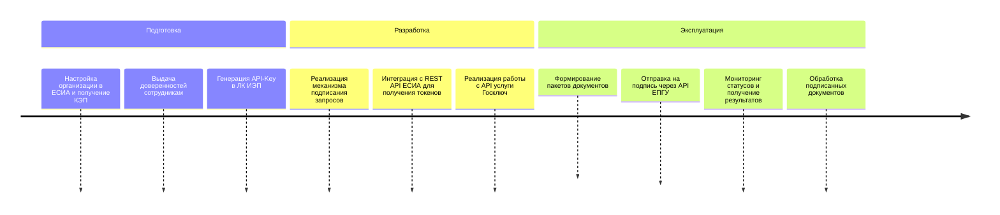
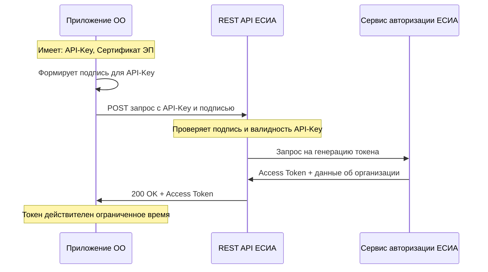

# Интеграция с Госключом через ЕПГУ: полный жизненный цикл

**Домен:** D12 · **Тип:** лучшая практика — руководство по интеграции
**Источник:** перенесено из `framework.univercon.aplicon.ru/docs/about/api/ExtAPI/GosKeyAPI/index.md`;
структурировано под фреймворк.

---

Полный сквозной цикл интеграции ОО с сервисом «Отправка документов на подпись в Госключ» —
от настройки прав в ЕСИА до скачивания подписанных документов. Применимо для юридически
значимого документооборота с обучающимися, работниками, контрагентами.

**Важно:** API Госключ для интеграторов — это **не** прямое API к мобильному приложению.
Это **API ЕПГУ для услуги «Отправка документов на подпись в Госключ»**. Все взаимодействия
идут через инфраструктуру государственных услуг.

## Общая схема



## 1. Ключевые понятия

| Термин | Смысл |
|---|---|
| **API-KEY** | Уникальный UUID уполномоченного сотрудника ОО. Не пароль, а идентификатор, используемый вместе с ЭП для получения токена |
| **Access Token** | Временный маркер доступа. Приложение получает его в обмен на API-Key + подпись |
| **Организация-потребитель** | ОО, использующая API (например, для отправки договоров на подпись) |
| **Организация-вендор** | Разработчик ПО, зарегистрировавший приложение в ЕСИА и дающий право использовать его для генерации API-Key |
| **ЕСИА** | Единая система идентификации и аутентификации |
| **ЕПГУ** | Единый портал государственных услуг |
| **ЛК ЮЛ ЕСИА** | Личный кабинет юридического лица в ЕСИА |
| **ЛК ИЭП** | Личный кабинет Инфраструктуры электронного правительства |

## 2. Подготовка организации-потребителя

### 2.1 Регистрация ОО в ЕСИА

1. Руководитель ОО получает квалифицированную электронную подпись (КЭП).
2. Регистрируется подтверждённая учётная запись руководителя в ЕСИА.
3. Регистрируется сама организация в ЕСИА.
4. Добавляются сотрудники в организацию через портал ЕСИА.

### 2.2 Выдача доверенностей

1. Руководитель через ЛК ЮЛ ЕСИА выдаёт сотрудникам доверенности на право формирования API-Key.
2. Сотруднику также выдаются права **«Администратор профиля организации»**.
3. Сотрудник включается в группу **«Технологический портал»** в ЛК ИЭП.

### 2.3 Формирование API-Key

1. Уполномоченный сотрудник авторизуется в ЛК ИЭП.
2. Переходит в раздел «Мои системы» → выбирает систему вендора (которая дала полномочия).
3. Генерирует API-Key для конкретного сотрудника ОО.

**Результат:** API-Key (UUID), привязанный к сотруднику + сертификату ЭП.

## 3. Получение маркера доступа (Access Token)

Приложение ОО обращается к специальному REST API ЕСИА:



**Что подписывать:** API-Key, сертификатом ЭП сотрудника или обезличенным сертификатом ОО.

**Что получаем:** Access Token с ограниченным временем жизни — используется для вызовов
API услуг ЕПГУ (в том числе Госключа).

## 4. Спецификация API «Отправка документов на подпись в Госключ»

### 4.1 Суть услуги

Приложение ОО (внешняя информационная система) отправляет через API ЕПГУ пакет документов
конкретному физическому лицу, чтобы тот подписал их в мобильном приложении «Госключ»
(УНЭП или УКЭП).

### 4.2 Ограничения

- **Кто может использовать:** руководители юрлиц, ИП или сотрудники со специальной доверенностью.
- **Получатель:** только **одно физическое лицо** в одном запросе.

### 4.3 Требования к документам

- **Форматы:** PDF, TIFF, XML, TXT
- **Не более 15 документов** в одном запросе
- **Общий объём** — не более 100 МБ

### 4.4 Требования к архиву

Отправляется **ZIP-архив**, который должен содержать:

- `req.xml` — файл с метаданными в строгом соответствии с XSD-схемой ЕПГУ
- Файлы документов для подписи
- Файлы отсоединённой электронной подписи `.sig` для каждого файла в архиве, **включая
  сам `req.xml`**. Подпись — КЭП отправителя (ОО).

### 4.5 Основные методы API

| Метод | Назначение |
|---|---|
| `POST /api/gusmev/order` | Создание заявления (получение `orderId`) |
| `POST /api/gusmev/push` | Загрузка архива с документами (обычный режим) |
| `POST /api/gusmev/push/chunked` | Загрузка архива по чанкам (для больших пакетов) |
| `POST /api/gusmev/order/{orderId}` | Получение деталей и статуса заявления |
| `GET /api/storage/v2/files/{orderId}/3/download?mnemonic={fileName}` | Скачивание подписанных документов и подписей |

## 5. Жизненный цикл запроса на подпись

1. Приложение ОО, используя Access Token, **создаёт заявление** и **загружает подписанный
   архив**.
2. Заявление получает статус **17** — «В очереди на отправку».
3. Документы направляются в мобильное приложение «Госключ» указанному получателю.
4. Получатель подписывает или отклоняет документы в приложении «Госключ».
5. Приложение ОО **периодически проверяет статус** заявления.
6. При успешном подписании (**статус 3** — «Документы подписаны») ОО скачивает файлы с
   подписями, полученными от «Госключ».

## 6. Типовые применения в ОО

- **Договоры с обучающимися** (платное обучение) — подписание договора и доп­соглашений.
- **Трудовые договоры и допсоглашения** с работниками (интерфейс с D07).
- **Согласия на обработку персональных данных** — от абитуриентов, обучающихся, их
  родителей.
- **Заявления и справки** — юридически значимая переписка с обучающимися.
- **Договоры с контрагентами** — сетевая форма (D04), базы практик, поставщики.

Отличие от электронного документооборота внутри ОО: Госключ — для документов, требующих
подписи **физлица со стороны получателя**, не самой ОО.

## 7. Типовые ошибки

**Считать Госключ отдельным API.**
Все операции идут через ЕПГУ. Госключ — это одна из услуг в экосистеме ЕПГУ. Прямого API
приложения «Госключ» для интеграторов нет.

**Пропустить включение в «Технологический портал».**
Права «Администратор профиля организации» недостаточно. Без группы «Технологический
портал» ЛК ИЭП не даст сгенерировать API-Key.

**Использовать `req.xml` без подписи.**
Все файлы в ZIP-архиве должны быть подписаны, **включая сам req.xml**. Пропуск подписи
req.xml — типовая причина отказа на этапе загрузки.

**Игнорировать ограничение на одного получателя.**
Один запрос — один получатель. Массовые рассылки требуют цикла и, возможно, батчирования
через несколько заявлений.

**Долгий polling без backoff.**
Проверять статус каждые несколько секунд — быстро упрётесь в rate limit ЕПГУ. Используйте
экспоненциальный backoff: 30 сек → 1 мин → 5 мин → 15 мин.

## 8. Тестовая среда

Разработку начинайте с тестового контура:

```
https://svcdev-beta.test.gosuslugi.ru
```

Продуктивная среда — только после полного цикла тестирования и получения продуктового API-Key.

## 9. Ссылки на нормативные документы

- Руководство пользователя для организации-потребителя по формированию API-Key и получению
  маркера доступа (версия 3.3 от 31.01.2023) — общий гайд по получению API-Key
- Спецификация API ЕПГУ «Отправка документов на подпись в Госключ» (версия 1.8) —
  конкретная спецификация услуги
- ФЗ от 06.04.2011 № 63-ФЗ «Об электронной подписи» — базовое правовое регулирование ЭП
- Постановление Правительства РФ от 05.07.2021 № 1076 (ЕСИА)

## 10. Стык с другими доменами

| Домен | Что использует Госключ |
|---|---|
| **D09 (финансы)** | Подписание договоров на платные услуги, актов, допсоглашений |
| **D07 (персонал)** | Трудовые договоры, допсоглашения, согласия работников |
| **D05 (контингент)** | Согласия обучающихся на обработку ПД, заявления |
| **D02 (лицензирование)** | Заявления в Рособрнадзор через ЕПГУ |
| **D11 (коммуникации)** | Официальные ответы на обращения граждан через ЕПГУ |
