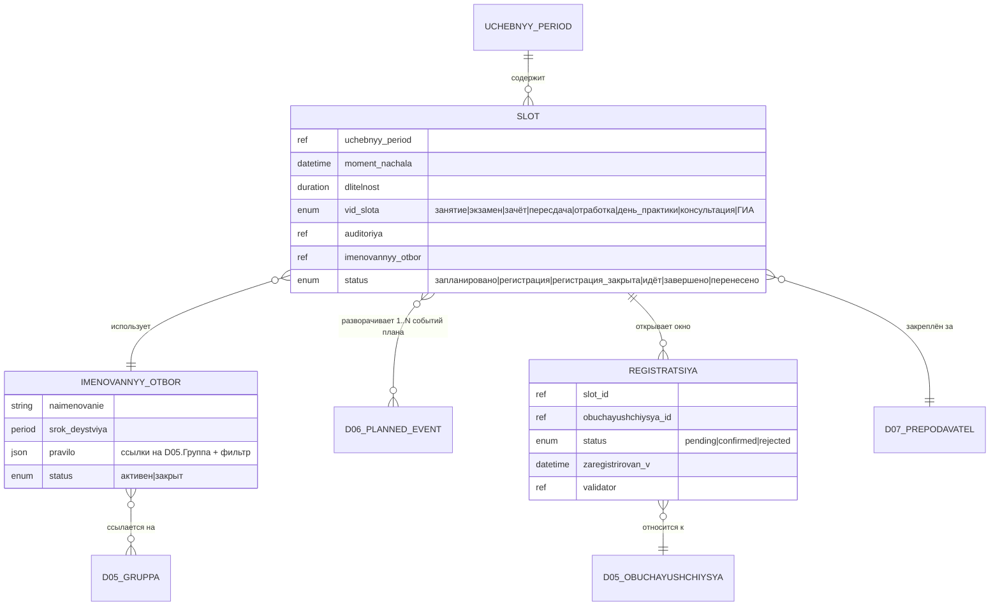

# D14 — Модель данных (платформонезависимая)

Статус: пересмотр от 2026-07-06. **Расписание не создаёт учебные события — оно их
разворачивает** (доклад «Цифровая инфраструктура вуза» §4). Запланированные события
живут в D06 (норма); D14 назначает им время, аудиторию, преподавателя и ресурсы.

---

## 1. Сущности

### 1.1 Учебный период

Временной контейнер расписания. Все слоты и запланированные события принадлежат периоду.

| Атрибут | Описание |
|---|---|
| наименование | «Осенний семестр 2025/26», «Модуль 2» и т.п. |
| начало / конец | календарные даты |
| тип | семестр / триместр / модуль / иное |
| учебный год | ссылка |

### 1.2 Именованный отбор

Персистентная сущность: хранит **правило** формирования состава слота, но не сам состав.
Состав вычисляется в момент проведения против актуальных **Групп** и
**Членств в группе** D05.

| Атрибут | Описание |
|---|---|
| наименование | «Поток 101+102, Физика, осень 2025» |
| срок действия | период (начало–конец), обычно совпадает с учебным периодом |
| правило | ссылки на `D05.Группа` (одна или несколько) + фильтр |
| статус | активен / закрыт |

**Инвариант:** именованный отбор не хранит список обучающихся. При каждом применении
правило вычисляется заново: берутся активные членства (`D05.Членство в группе`) на дату
слота в ссылочных группах, применяется фильтр. Снимок состава замораживается в D04
при переходе слота в «идёт».

**Соотношение с D05.Группа.** D05 уже определяет типы групп через `Группа.tip`
(основная учебная / подгруппа / поток / элективная). Именованный отбор — это **правило
поверх** одной или нескольких групп. Примеры:

- *Поток лекции* — правило: `groups IN ("101-осн", "102-осн")`
- *Языковая подгруппа* — правило: `groups = "101-англ-п1"`
- *Электив* — правило: `groups = "Электив-Философия-осень-2025"`
- *Группа практики* — состав, направленный на конкретную базу

Тип отбора выводится из типов ссылочных групп D05.

### 1.3 Слот расписания

**Ключевая единица D14** — временной интервал + ресурсы, покрывающий 1..N
запланированных учебных событий из D06. Из фразы автора при обсуждении:

> «Одно занятие как единица расписания содержит в себе событие минимум одно, но может
> и больше на одном занятии — к примеру, может быть модульный контроль, причём в нём
> могут участвовать не все.»

Слот — это единица расписания в широком смысле. Виды слотов покрывают всё, что
разворачивается по сетке: занятие, экзамен, зачёт, пересдача, отработка, день
практики, консультация, ГИА.

| Атрибут | Тип | Описание |
|---|---|---|
| id | UUID | Идентификатор |
| учебный_период | ссылка | §1.1 |
| дата_и_время | datetime | Момент начала |
| длительность | duration | Пара / рабочий день / N часов |
| вид_слота | enum | занятие / экзамен / зачёт / пересдача / отработка / день_практики / консультация / ГИА |
| преподаватель | ссылка | D07 |
| аудитория | ссылка? | Помещение (для дня практики — пусто) |
| именованный_отбор | ссылка | §1.2 — правило состава слота |
| события | список ссылок | Запланированные учебные события D06 §1.12, разворачиваемые на этом слоте |
| статус | enum | См. §2 — жизненный цикл |

**Ключевое отличие от прежней модели:** слот не хранит «дисциплина / тип события /
форма контроля» напрямую — эти атрибуты принадлежат **запланированному учебному
событию D06 §1.12**, на которое слот ссылается. Один слот может ссылаться на
1..N событий с разными видами (само занятие + модульный контроль темы) и разными
правилами состава (все / подмножество через `assignment_mode`).

**Что удерживает связь слота и событий:**
- Один слот D14 → 1..N `PlannedEvent` D06
- Слот подставляет runtime-контекст (дата, время, аудитория, преподаватель,
  снимок состава); события подставляют норму (что происходит, форма контроля, пакет)

### 1.4 Регистрация на слоте

Процесс аутентификации присутствия. Из Дидактикон Блок III §5: MVP-версия —
однофакторная, по нажатию кнопки в открытом окне регистрации.

| Атрибут | Тип | Описание |
|---|---|---|
| id | UUID | Идентификатор |
| слот_id | ссылка | §1.3 |
| обучающийся_id | ссылка | D05.Обучающийся |
| статус | enum | pending / confirmed / rejected |
| зарегистрирован_в | datetime? | Момент нажатия «Отметиться» |
| валидатор | ссылка? | Кто подтвердил / отклонил (обычно педагог на переходе «начать занятие») |
| валидирован_в | datetime? | Момент подтверждения |
| факторы | список? | Заготовка для v2 (factor-стек knowledge/possession/location/inherence — вне MVP) |

**Инварианты:**
- Регистрация открывается автоматически в момент перехода слота в состояние «регистрация»
  (N минут до плана — параметр учётной политики)
- `confirmed` наступает автоматически по нажатию «Отметиться» внутри окна регистрации;
  `rejected` — только явным действием педагога
- Пересчёт статуса слота учитывает регистрации всех обучающихся, чей состав по
  именованному отбору попадает на слот

### 1.5 Нагрузка преподавателя (агрегат)

Не самостоятельная сущность, а **вычисляемый агрегат** из слотов расписания в разрезе
преподавателя и периода. Потребляется D07 для штатного расчёта.

| Атрибут | Описание |
|---|---|
| преподаватель | ссылка на D07 |
| учебный период | ссылка |
| часы по видам | лекции / практики / семинары / … (выводятся из видов запланированных событий на слотах) |
| источник | агрегат из слотов периода |

---

## 2. Жизненные циклы

### 2.1 Слот расписания — виды, требующие полного цикла

Виды: **занятие / экзамен / зачёт / пересдача / отработка / консультация / ГИА** —
проходят полный жизненный цикл из 6 состояний (Дидактикон Блок III §4):

```
запланировано → регистрация → регистрация_закрыта → идёт → завершено
                                                              ↘ перенесено
```

- **запланировано** — слот создан, до открытия окна регистрации далеко
- **регистрация** — открылось окно (N минут до плана); обучающиеся отмечаются, статус
  регистрации у каждого `pending → confirmed`
- **регистрация_закрыта** — окно закрыто (в момент регламентного начала); педагог
  ещё не подтвердил своё присутствие («начать»)
- **идёт** — педагог нажал «начать» (тем же действием подтверждается его
  присутствие); **при переходе в это состояние D14 инициирует создание учебных
  событий D04 согласно списку событий слота**
- **завершено** — педагог нажал «закончить»; inline-формы принудительно завершаются
  в D04, extended продолжают жить со своими дедлайнами
- **перенесено** — два подпроцесса (rescheduling + explanation), см. Дидактикон Блок III
  §4.6

### 2.2 Слот вида «день практики» — упрощённый цикл

День практики отличается: свидетель — база / СКУД / скан, аудитории нет, регистрация
как процесс аутентификации присутствия не применяется (её роль играет свидетельство
руководителя базы). Цикл:

```
запланировано → идёт → завершено
                       ↘ перенесено
```

Переход в «идёт» — по календарной дате; в «завершено» — по завершении рабочего дня
или закрытии периода практики. Регистрация как процесс не применяется — присутствие
на базе фиксируется в D04 отдельно, через свидетеля-базу и валидатора-кафедру
(academic-concept v1.4 §17).

### 2.3 Перенос слота

Перенос — пара событий:
- Исходный слот → **перенесено**
- Новый слот создаётся с ссылкой на исходный (`replaces_slot_id`)

Учебные события D06, к которым относился слот, **не пересоздаются** — они те же
самые, просто разворачиваются на новом слоте.

---

## 3. Инварианты

1. **Расписание разворачивает план, не создаёт события** (доклад §4). Запланированные
   учебные события живут в D06; D14 назначает им ресурсы и время через слоты.
2. **Один слот → 1..N запланированных событий D06.** Пример: слот пары содержит
   «занятие по D» + «модульный контроль темы 3».
3. **Именованный отбор не хранит состав** — только правило. Снимок вычисляется при
   переходе слота в «идёт» и замораживается в D04.
4. **Нагрузка — агрегат, не первичная запись.** Первичны слоты; нагрузка
   пересчитывается при изменении расписания.
5. **Отменённый / перенесённый слот не порождает учебных событий D04.** D04 получает
   события только от слотов, реально перешедших в «идёт».
6. **Перенос — пара событий:** исходный → «перенесено», новый → «запланировано» с
   ссылкой. Запланированные события D06 остаются теми же.
7. **Регистрация — процесс уровня слота, не уровня события.** Обучающийся отмечается
   на слоте один раз; отметка распространяется на все учебные события внутри
   (у каждого из которых свой состав через `assignment_mode` в форме контроля).
8. **День практики без окна регистрации.** Свидетель — база; валидатор — кафедра;
   регистрация как процесс аутентификации не применяется.

---

## 4. Контракты с другими доменами

### D14 ← D06: план учебных событий → слоты

D14 читает **план запланированных учебных событий** D06 (§1.12) и разворачивает его
на слоты. Один слот D14 покрывает 1..N событий D06.

Что D14 получает от D06:
- Список запланированных событий на период (из РПД дисциплин + строк УП)
- Их видов, привязок (дисциплина / тема / вид / форма контроля / пакет)
- Ожидаемых длительностей
- Формы проведения (очно / онлайн / гибрид)

Что D14 добавляет:
- Дата, время
- Аудитория
- Преподаватель
- Именованный отбор (правило состава слота)

D14 не меняет план; при отмене / переносе слота учебное событие D06 остаётся —
меняется только его развёртка на календаре.

### D14 → D04: слот вошёл в «идёт» → учебные события

При переходе слота в состояние «идёт» D14 инициирует создание учебных событий D04
для **каждого** запланированного события D06, привязанного к слоту. Передаётся:
- ссылка на запланированное событие D06 (`planned_event_id`)
- момент начала, длительность (из слота)
- снимок состава именованного отбора
- ссылка на слот (`slot_id`)

D04 далее управляет буфером, обязательствами и записями самостоятельно (§4
academic-concept v1.4). Состав каждого учебного события — пересечение снимка
состава слота × правил `assignment_mode` формы контроля события.

### D14 ← D05: группы и членство

D14 читает **Группы** D05 (сущность `Группа`) и **актуальные Членства**
(`Членство в группе` — M:N во времени) при вычислении именованного отбора.
Читается срез на дату слота.

D14 не владеет составом групп и не меняет членство: изменения — только через приказы D05
(перевод, зачисление, отчисление). Правило D14 при этом остаётся неизменным.

### D14 → D07: нагрузка ППС

D14 предоставляет D07 агрегат нагрузки преподавателей из слотов. Момент и формат
передачи — открытый вопрос (см. CHANGELOG).

---

## 5. ERD (mermaid)



> Внешние сцепки (за пределами D14):
> - `D06.PlannedEvent }o--o{ Slot : "1..N событий на слот"` (главный контракт)
> - `D04.UchebnoeSobytie(факт) }o--|| Slot : "порождено слотом при переходе в идёт"`
> - `D04.UchebnoeSobytie(факт) }o--|| D06.PlannedEvent : "реализует план"`
