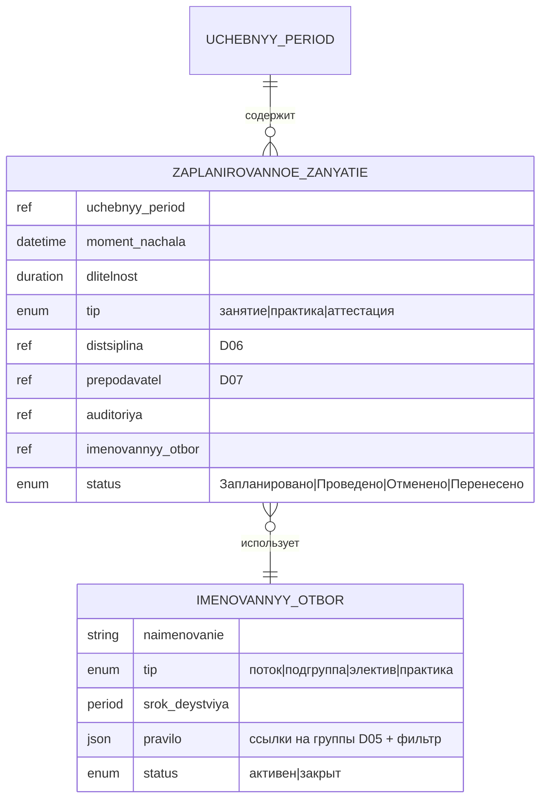

# D14 — Модель данных (платформонезависимая)

Статус: черновик первого среза. Описывает ядро планирующего слоя учебного процесса.

---

## 1. Сущности

### 1.1 Учебный период

Временной контейнер расписания. Все запланированные занятия принадлежат периоду.

| Атрибут | Описание |
|---|---|
| наименование | «Осенний семестр 2025/26», «Модуль 2» и т.п. |
| начало / конец | календарные даты |
| тип | семестр / триместр / модуль / иное |
| учебный год | ссылка |

### 1.2 Именованный отбор

Персистентная сущность: хранит **правило** формирования состава занятия, но не сам состав.
Состав вычисляется в момент создания журнала в D04 против текущих административных групп D05.

| Атрибут | Описание |
|---|---|
| наименование | «Поток 101+102, Физика, осень 2025» |
| тип | поток / подгруппа / группа элективов / группа практики / иное |
| срок действия | период (начало–конец), обычно совпадает с учебным периодом |
| правило | ссылки на административные группы D05 + фильтр (дисциплина, номер подгруппы и т.п.) |
| статус | активен / закрыт |

**Инвариант:** именованный отбор не хранит список обучающихся. При каждом применении
правило вычисляется заново против актуального D05. Снимок состава замораживается в D04.

**Примеры типов:**
- *Поток* — объединение нескольких административных групп для совместного занятия
- *Подгруппа* — часть группы по числовому признаку (подгруппа 1 из 101)
- *Группа элективов* — обучающиеся из разных групп, выбравшие один электив
- *Группа практики* — состав, направленный на конкретную базу практики

### 1.3 Запланированное занятие

Элементарная единица расписания. Статус [Запланировано] принадлежит этой сущности.

| Атрибут | Описание |
|---|---|
| учебный период | ссылка |
| дата и время | момент начала |
| длительность | пара / рабочий день / иное |
| тип | занятие / день практики / аттестационное событие |
| дисциплина / элемент УП | ссылка на D06 |
| преподаватель | ссылка на D07 |
| аудитория | ссылка (помещение) |
| именованный отбор | ссылка на §1.2 |
| статус | Запланировано / Проведено / Отменено / Перенесено |

При переводе статуса в [Проведено] → D14 инициирует создание учебного события в D04,
передавая снимок состава именованного отбора.

### 1.4 Нагрузка преподавателя (агрегат)

Не самостоятельная сущность, а **вычисляемый агрегат** из запланированных занятий в разрезе
преподавателя и периода. Потребляется D07 для штатного расчёта.

| Атрибут | Описание |
|---|---|
| преподаватель | ссылка на D07 |
| учебный период | ссылка |
| часы по видам | лекции / практики / семинары / … |
| источник | агрегат из запланированных занятий периода |

---

## 2. Жизненный цикл запланированного занятия

```
[Запланировано]
  ├─ событие стартовало → [Проведено]
  │     └─ D14 инициирует создание учебного события в D04
  │           (тип, момент, длительность, снимок состава именованного отбора)
  ├─ отмена до старта → [Отменено]
  │     (D04 событие не создаётся)
  └─ перенос → новое запланированное занятие с ссылкой на исходное
        исходное → [Перенесено]
```

---

## 3. Инварианты

1. **Именованный отбор не хранит состав** — только правило. Снимок вычисляется при передаче
   в D04 и замораживается там.
2. **Нагрузка — агрегат, не первичная запись.** Первичны запланированные занятия; нагрузка
   пересчитывается при изменении расписания.
3. **Отменённое занятие не порождает учебного события в D04.** D04 получает только
   фактически стартовавшие события.
4. **Перенос — пара событий:** исходное → [Перенесено], новое → [Запланировано] со ссылкой.
   Не редактирование существующей записи.

---

## 4. Контракты с другими доменами

### D14 → D04: запланированное занятие → учебное событие

D14 инициирует создание учебного события в D04 при старте занятия. Передаёт:
- тип, момент начала, длительность
- состав: именованный отбор вычислен против D05, передан снимком

D04 далее управляет буфером, обязательствами и записями самостоятельно.

### D14 ← D05: административные группы

D14 читает состав административных групп D05 при вычислении именованного отбора.
D14 не владеет составом групп и не меняет его.

### D14 → D07: нагрузка ППС

D14 предоставляет D07 агрегат нагрузки преподавателей из запланированных занятий.
Момент и формат передачи — открытый вопрос (см. CHANGELOG).

### D14 ← D06: учебный план

D14 ссылается на элементы учебного плана D06 при создании запланированных занятий.
D06 владеет учебным планом; D14 его не меняет.

---

## 5. ERD (mermaid)


